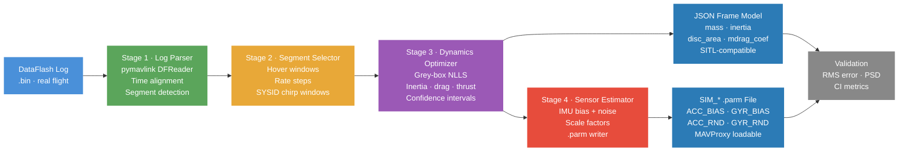
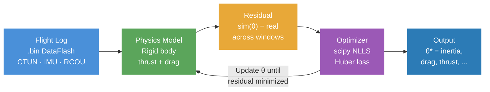

# GSoC 2026 Proposal: SITL Model Generation from Flight Data

---

## Contact Information

- **Name:** Aashrith Bandaru
- **Email:** bandaru6@illinois.edu
- **GitHub:** github.com/bandaru6
- **University:** University of Illinois Urbana-Champaign
- **Major:** B.S. Computer Science + B.S. Statistics (Dual Degree), Minor in Math and Economics
- **GPA:** 3.83 / 4.0
- **Year:** Sophomore (2nd year by summer 2026)
- **Location:** Fremont, CA (summer)

---

## Project

**Project Name:** SITL Model Generation from Flight Data

**Project Description:**

ArduPilot's Software-In-The-Loop simulator (SITL) is one of the most powerful tools in the
entire ArduPilot ecosystem. Developers use it to test new features, debug autopilot behavior,
and train autonomy algorithms on a regular computer without hardware. But there is a
fundamental problem: the physics models SITL uses are generic defaults, not tuned to any
specific vehicle.

To be concrete: a 5-inch racing quad and a heavy X8 octocopter fly completely differently
in the real world, but SITL treats them nearly the same with default parameters. The result
is a simulation that does not represent the real vehicle — which defeats the purpose of
simulation-based testing and introduces false confidence in algorithms validated only in
simulation.

**This project replaces manual parameter guessing with a data-driven pipeline.** Given a
real ArduPilot DataFlash flight log, the tool estimates key vehicle dynamics and sensor
parameters using grey-box system identification, and outputs two files: an updated SITL
JSON frame model and a SIM_* sensor parameter file. From a developer's perspective: run
one command on your flight log, get a SITL model that behaves like your vehicle.

Both outputs are directly loadable into ArduPilot's existing SITL infrastructure via
sim_vehicle.py and MAVProxy — no custom simulator required, no manual tuning needed.
The project also supports ArduPilot's dedicated SYSID flight mode, which injects chirp
frequency sweeps into control loops and logs synchronized response data, producing the
richest possible dataset for parameter estimation.

ArduPilot already has investment in this direction: SYSID mode documentation explicitly
lists "generating mathematical models for model generation" as a primary use case, and
ArduPilot ships MATLAB/Simulink workflows (including scripts like `sid_pre.m` that read
SYSID DataFlash logs) for controller and plant modeling. This project builds the
Python-native, open-source equivalent — integrated directly with ArduPilot tooling.

**Scope Clarification:** This project targets **multicopters only** (quadrotor, hex,
octocopter). No fixed-wing or helicopter support is included in core or extended
deliverables. All abstractions are designed for future extension but not implemented
during GSoC. This focus is intentional: doing one vehicle type correctly is more valuable
than doing four vehicle types poorly.


*Mermaid alternative (renders natively on GitHub):*



---

## Deliverables

**Core deliverables (guaranteed):**

1. A Python CLI tool that parses a DataFlash .bin log and runs the full identification
   pipeline for multicopters
2. A fitted JSON frame model compatible with ArduPilot's multicopter SIM_Frame loader
3. A SIM_* .parm file for sensor parameters, loadable via MAVProxy or sim_vehicle.py
4. A fit report with parameter values, confidence intervals, identifiability diagnostics,
   and sim-vs-real validation metrics
5. Regression test suite in CI that guards against optimizer regressions

**Extended deliverables (target, scope confirmed with mentor during community bonding):**

6. Support for SYSID-mode chirp logs with frequency-domain validation
7. Full documentation and runbook: developer can go from raw .bin to running SITL with
   the fitted model in under 15 minutes

**Stretch deliverables:**

8. Cross-vehicle abstraction layer for future extension to planes and helicopters
9. Transfer function comparison for SYSID chirp validation
10. Cross-log generalization testing across multiple vehicles of the same type

---

## Developer Workflow (End-to-End)

This is what a typical ArduPilot developer does with this tool:

```bash
# Step 1 — run a normal flight, collect a DataFlash log
#           (or a SYSID-mode chirp flight for best results)

# Step 2 — run the tool
python3 log_to_model_params.py flight.bin --output-dir ./out --vehicle-type copter

# Step 3 — load into SITL
sim_vehicle.py -f JSON:./out/frame_model.json
param load ./out/sim_sensors.parm

# Step 4 — validate
# tool generates side-by-side real vs simulated plots in ./out/validation/
```

Output files produced:
- `frame_model.json` — drop-in replacement for ArduPilot's default multicopter frame JSON
- `sim_sensors.parm` — MAVProxy-loadable SIM_* sensor parameters
- `fit_report.txt` — parameter table, confidence intervals, identifiability warnings

Target time from raw .bin to running SITL: **under 15 minutes**.

The tool removes: manual parameter tuning, trial-and-error SITL calibration, and
dependency on MATLAB/Simulink workflows. It does not introduce a new workflow — it
**automates an existing one** that developers already do by hand.

---

## Why Developers Will Use This

The adoption barrier for new developer tooling is high. This tool is designed to clear it:

- **Uses existing artifacts:** DataFlash logs are already collected during normal development
  flights — no special hardware, no dedicated calibration rig
- **Outputs to existing workflows:** JSON and .parm files load directly into the SITL
  infrastructure developers already use; no changes to ArduPilot core required
- **Replaces MATLAB dependency:** ArduPilot's existing SYSID scripts require MATLAB/Simulink;
  this project delivers a fully open-source Python alternative
- **Fails informatively:** when the data is insufficient to estimate a parameter, the tool
  tells the developer what flight maneuver to fly to fix it — rather than returning
  a misleading value

The goal is not a research prototype. It is a tool that makes a developer's Tuesday better.

---

## Integration Plan

The tool is designed to integrate cleanly into ArduPilot's existing ecosystem with no
changes to the core codebase:

**Initial location:** `Tools/autotest/log_to_model_params.py` or `Tools/scripts/`,
consistent with ArduPilot's existing Python tooling directory conventions. Exact placement
to be confirmed with mentor during community bonding.

**Design principles:**
- No changes required to SITL core, SIM_Frame.cpp, or sim_vehicle.py
- JSON schema aligned with SIM_Frame.cpp field names and units (already verified)
- .parm output format compatible with standard `param load` MAVProxy command
- CLI interface consistent with other ArduPilot Python tools

**Future integration opportunities (post-GSoC):**
- Reference multicopter model JSONs contributed to ArduPilot/SITL_Models
- Parser improvements contributed upstream to pymavlink
- Potential complementary use with ArduPilot/WebTools SysID browser tool for
  visual validation alongside the parameter export this project produces

---

## Alternate Projects

If SITL Model Generation were not available, I would consider the AI-Assisted Log Diagnosis
project, where my Statistics background maps directly to the anomaly detection and
time-series classification problem. My interest in this project is unambiguous — I have
already built working code, read the source files, and engaged with the mentor specifically
for it.

---

## Why I Am Interested in This Project

**The problem, in plain terms**

When you run SITL with default parameters and compare the output to real flight data, you
almost always see a gap. The simulated vehicle pitches too fast or too slow. The
throttle-to-thrust relationship is off. The gyroscope bias is wrong. Each gap traces back to
a specific physics or sensor parameter that was never tuned to the real vehicle.

Closing that gap is a parameter estimation problem: you have a model with unknown
coefficients, you have observations of the real system, and you want to find the coefficients
that make the model match the observations. This is formally the same as fitting any
statistical model to data — with the added complexity that the model is a nonlinear system
of differential equations, the data is noisy and irregularly sampled, and some parameters
are unidentifiable from a given dataset.

This is exactly the kind of problem I find genuinely interesting. My Statistics degree is
not just coursework for me; it is a lens through which I see engineering problems. When I
read about system identification, I see maximum likelihood estimation. When I look at IMU
bias, I see a latent variable that needs to be inferred. When I think about parameter
confidence intervals, I am thinking about what the Fisher information matrix tells us about
how much useful information the flight data actually contains.

I also enjoy problems where the hard part is not writing a model, but figuring out whether
the data actually justifies the conclusion. That is what identifiability analysis is: a
formal answer to "can we even estimate this from what we have?" This project needs that
kind of thinking at every stage, and I am excited to refine the approach with mentor
feedback throughout the summer.

**Pre-application work**

Before writing this proposal, I did the following:

1. Set up the ArduPilot SITL environment locally and ran sim_vehicle.py with a custom JSON
   frame model to verify the loading mechanism end-to-end
2. Read through SIM_Frame.cpp and SIM_Frame.h to catalog all JSON-loadable parameters
   and understand how ArduPilot computes thrust, drag, and rotational forces in simulation
3. Read the SYSID mode documentation to understand the chirp injection workflow and
   the SID log message format, including that SID records average IMU measurements taken
   directly from hardware without extra filtering — improving time alignment for identification
4. Written and tested a working DataFlash .bin parser using pymavlink.DFReader_binary
   that extracts hoverThrOut from CTUN.ThO, propExpo from MOT_THST_EXPO, PWM range
   from RCOU, and battery parameters from BAT messages, with correct handling of both
   old-format logs (TimeMS, ThO 0-1000 scale) and new-format logs (TimeUS, ThO 0-1 scale).
   Tested on a real .bin log, producing hoverThrOut = 0.387 and propExpo = 0.8
5. Posted on the ArduPilot forum in the GSoC 2026 category to introduce myself and get
   mentor feedback before submitting this proposal
6. Identified a scoped fix to pymavlink (issue #1033: parameter message handling in
   mavlogdump.py) and plan to submit it as a PR during community bonding

All code is at: github.com/bandaru6/gsoc-sitl-sysid


**Research that shaped the design**

Burri et al. (2020), "Identification of the Propeller Coefficients and Dynamic Parameters
of a Hovering Quadrotor From Flight Data" (IEEE RA-L) — the closest prior work to this
project. Their segmented grey-box optimization approach is the structural baseline for
Stage 3, and their parameter set maps almost directly onto ArduPilot's JSON fields.

Tedaldi et al. (2014), "A Robust and Easy to Implement Method for IMU Calibration Without
External Equipment" (ICRA) — the static calibration method directly informs Stage 4:
pre-arm stationary windows for bias estimation, flight windows for noise characterization.

Torrente et al. (2021), "Data-Driven MPC for Quadrotors" (IEEE RA-L, IROS) — demonstrates
that fitting dynamics to real flight data substantially outperforms hand-tuned models. Their
held-out validation methodology shaped how I structured the evaluation harness.

Ljung (1999), "System Identification: Theory for the User" — foundational treatment of
identifiability, prediction error methods, and the Cramer-Rao bound for parameter
uncertainty. Chapters 7 and 14 directly inform the uncertainty quantification in Stage 3.

---

## Proposed Architecture

The project is five sequential processing stages. Every stage has a clear input, a clear
output, and can be tested independently. Partial progress is always useful: a working parser
is valuable even without a working optimizer.


*Mermaid alternative (renders natively on GitHub):*



**Algorithm stack:**

*Baseline (core deliverable):*
- Robust NLLS with physical bounds and Huber/soft-L1 loss for outlier robustness
- MAP regularization with priors centered at typical ArduPilot vehicle ranges, for
  under-excited regimes where the data cannot uniquely constrain all parameters
- Gauss-Newton approximate Hessian for CIs; bootstrap resampling for empirical CIs
- Cross-validation across log windows

*Advanced (stretch):*
- Frequency-domain transfer function comparison for SYSID chirp validation, complementing
  the existing ArduPilot WebTools SysID browser tool

**Failure modes and behavior:**

The tool is designed to never fail silently. Specific guarantees:

| Condition | Tool behavior |
|-----------|--------------|
| Parameter unidentifiable from available data | Excluded from optimization; ArduPilot default retained; fit report flags with plain-language warning and recommended flight maneuver |
| Key log message type missing | Specific warning emitted; affected parameter groups listed; pipeline continues on available data |
| Log file corrupt or unreadable | Clear error with actionable message; no partial output written |
| Optimizer does not converge | Default returned; convergence diagnostic included in report |

The tool never returns NaN, never outputs unconstrained parameters silently, and never
crashes on missing messages. These are not nice-to-haves — they are the minimum requirement
for a tool that developers will actually trust.

### Stage 1: Log Parser and Time Alignment

**What it does:** ArduPilot logs multiple streams at different rates. IMU might log at
400 Hz, motor commands at 50 Hz, attitude at 25 Hz. All streams need to be resampled to
a common timebase and synchronized. This stage also handles real-world log messiness:
different time field names across firmware versions, missing messages, logging dropouts,
and multiple IMU instances.

**Key details:**
- pymavlink DFReader_binary with transparent handling of old-format (TimeMS, ThO 0-1000)
  and new-format (TimeUS, ThO 0-1) logs — already implemented and tested
- Message types extracted: ACC, GYR, RCOU, CTUN, ATT, BARO, BAT, PARM, SID (SYSID)
- Resample all streams to 50 Hz common timebase using linear interpolation for continuous
  signals and zero-order hold for discrete signals
- Detect flight phases: pre-arm static (IMU bias), hover (hoverThrOut, sensor noise),
  maneuver (inertia), forward-flight (drag), SYSID chirp (if SID messages present)
- Reject windows with EKF health failures, GPS dropouts, excessive vibration (VIBE), or
  insufficient signal excitation

**Milestone 1:** Parser handles ≥3 different .bin logs across ≥2 firmware versions.
Segment detector correctly identifies hover windows on ≥2 real logs.

### Stage 2: Segment Selector

**What it does:** Not all parts of a flight are equally useful. A hover segment tells you
about hover throttle but not rotational inertia. A sharp rate step tells you about inertia
but not drag at speed. SYSID chirp logs are the richest possible source — with controlled
excitation designed specifically for identification. This stage finds the windows most
informative for each parameter group.

**Key details:**
- Classify each window as pre-arm static, hover, rate step, forward-flight, or SYSID chirp
- Compute excitation quality score per window; rank and select top N per parameter group
- Condition number check on regressor matrix to assess identifiability from each window

### Stage 3: Grey-Box Dynamics Optimizer

**What it does:** Find the physics parameters that make the simulation most closely
reproduce what the real vehicle did. Grey-box means we keep the known physics structure
and only estimate the unknown coefficients — so results map directly to ArduPilot JSON
fields and remain physically interpretable.

**Parameter mapping to ArduPilot JSON fields:**

| Estimated parameter | ArduPilot JSON field | Estimation method |
|--------------------|--------------------|------------------|
| Hover throttle | hoverThrOut | Median CTUN.ThO in hover |
| Thrust nonlinearity | propExpo | Logged MOT_THST_EXPO or fit |
| Rotational inertia | moment_of_inertia | NLLS on rate step windows |
| Momentum drag | mdrag_coef | NLLS on forward-flight windows |
| Rotor disc area | disc_area | Combined with thrust fit |
| Motor PWM range | pwmMin, pwmMax | Min/max RCOU across flight |
| Battery reference voltage | refVoltage | Median BAT.Volt in cruise |

**Milestone 2:** Optimizer converges with physically plausible values on ≥2 real logs.
JSON output loads into SITL without errors via sim_vehicle.py.

### Stage 4: Sensor Parameter Estimator

**What it does:** Even a perfect physics model will not match reality if the simulation
uses wrong IMU characteristics. ArduPilot SITL exposes SIM_ACC*_BIAS, SIM_GYR*_BIAS,
SIM_ACC*_RND, SIM_GYR*_RND, and SIM_ACC*_SCAL. This stage estimates them from the log.

- Pre-arm static windows: accelerometer deviation from expected gravity → ACC_BIAS;
  gyroscope mean → GYR_BIAS
- Steady hover variance → noise proxy for ACC_RND and GYR_RND
- Scale estimation where flight profile supports it; explicit warning otherwise

**Milestone 3:** Sensor parameters estimated within physically reasonable range on ≥2 logs.
Full CLI runs end-to-end in under 60 seconds.

### Stage 5: Output Writers and Validation Harness

**What it does:** Write all parameters to files ArduPilot SITL can use, validate the
fitted model against held-out data, and produce a fit report a developer can act on.

- JSON aligned to SIM_Frame field names and units (verified against SIM_Frame.cpp)
- .parm writer compatible with `param load` MAVProxy command
- Fit report: parameter table, CIs, identifiability warnings, validation metrics
- Validation runner: replay fitted model in SITL against held-out segments; compare to
  real log and ArduPilot defaults; generate side-by-side comparison plots
- pytest + GitHub Actions CI with full pipeline regression test

---

## Risks and Scope Reduction Plan

| Risk | Mitigation |
|------|-----------|
| Weak identifiability on available logs | Restrict to high-confidence parameters; warn explicitly; prioritize SYSID logs |
| Logs lack sufficient excitation | Shift validation to SYSID-mode or synthetic SITL logs with known ground truth |
| Sensor scale estimation unsupported | Deliver bias and noise only; document required flight maneuver |
| Cross-vehicle generality harder than expected | Multicopter-only; document extension points |
| JSON field mapping broader than expected | Prioritize 5 highest-impact fields first |
| Scope slippage | 50-hour rolling buffer; each phase produces standalone usable artifact |

Reduction order if needed: stretch → extended → core. Core five deliverables are the
minimum definition of success.

---

## Project Plan and Timeline

### Pre-Application Work (Already Completed)

- Cloned ArduPilot and built SITL locally from source
- Ran sim_vehicle.py with a custom JSON frame model to verify end-to-end loading
- Read and annotated SIM_Frame.cpp and SIM_Frame.h to map all JSON-loadable fields
- Read the SYSID mode documentation; understood SID message format and IMU averaging
- Written and tested log_to_model_params.py: a working DataFlash parser producing a
  SITL-compatible JSON (hoverThrOut = 0.387, propExpo = 0.8) from a real .bin log
- Posted on the ArduPilot GSoC forum to introduce myself and get mentor feedback
- Identified pymavlink issue #1033 as a scoped upstream contribution to begin before
  coding starts

All code is public at github.com/bandaru6/gsoc-sitl-sysid.

### Community Bonding (May 8 to June 1, not counted in 350 hours)

- Sync with mentor on: highest-priority parameter groups, preferred log baseline (ordinary
  vs SYSID), repository location, and quantitative targets realistic for available datasets
- Identify 3–5 real flight logs to use as development baselines; confirm with mentor
- Complete and submit pymavlink issue #1033 fix as a PR
- Set up GitHub Actions CI: lint, unit tests, sample log regression test
- Review ArduPilot's existing SYSID tooling (issue #22704, MATLAB scripts) and document
  gaps this project fills
- Milestone: mentor alignment confirmed, CI running, upstream contribution in review

**Communication plan:** Weekly sync with mentor, mid-week async updates via GitHub issues
or PR comments, early PRs per stage (not one large PR at the end).

### Phase 1: Log Parser and Time Alignment (Weeks 1–3, 70 hours)

- Extend parser to handle all relevant message types across firmware versions
- Time alignment, flight phase detection, quality filters
- Unit tests on both synthetic and real .bin logs
- **Milestone 1:** ≥3 logs parsed; ≥2 firmware versions; CI passing

### Phase 2: Dynamics Model and Parameter Optimizer (Weeks 4–6, 80 hours)

- Forward dynamics model mirroring SIM_Frame.cpp physics exactly
- Staged optimizer: hoverThrOut (closed-form), inertia (NLLS), mdrag_coef (NLLS)
- Physical bounds on all parameters; JSON writer
- **Milestone 2:** Forward model within 5% of SITL on synthetic logs; JSON loads in SITL

### Phase 3: Uncertainty Quantification and Identifiability Diagnostics (Weeks 7–8, 70 hours)

- Gauss-Newton Hessian + bootstrap CIs
- Condition number and correlation diagnostics
- MAP regularization; plain-language warnings in fit report
- **Milestone 3:** CIs on ≥2 logs; warnings trigger correctly on hover-only logs

### Phase 4: Sensor Parameter Estimation and Full CLI (Weeks 9–10, 40 hours)

- ACC/GYR bias and noise estimation
- .parm writer; fit_report.txt; single CLI entry point
- **Milestone 4:** Full CLI end-to-end in under 60 seconds

### Phase 5: Validation Harness, Documentation, and SYSID Polish (Weeks 11–12, 40 hours)

- Validation runner: held-out segments vs real log and defaults; comparison plots
- Regression tests in CI
- Complete documentation: runbook, API reference, troubleshooting guide
- SYSID polish: dedicated SID message parsing, frequency-domain metrics
- **Milestone 5:** Measurable error reduction on ≥2 logs; runbook usable in under 15 min

### Timeline Summary


*Mermaid alternative:*


| Phase | Weeks | Hours | Key Deliverable | Milestone |
|-------|-------|-------|-----------------|-----------|
| Community Bonding | Pre-coding | (not counted) | Mentor sync, CI, upstream PR | pymavlink fix submitted |
| 1: Log Parser | 1–3 | 70h | Robust parser + segment detection | 3 logs parsed; CI passing |
| 2: Dynamics Model | 4–6 | 80h | Grey-box optimizer + JSON writer | JSON loads in SITL |
| 3: Uncertainty | 7–8 | 70h | CIs + identifiability diagnostics | Warnings on hover-only logs |
| 4: Sensor + CLI | 9–10 | 40h | IMU bias/noise + full CLI | End-to-end < 60s |
| 5: Validation + Docs | 11–12 | 40h | Validation harness + runbook | Measurable error reduction |
| Buffer | Rolling | 50h | Risk mitigation, mentor feedback | Per phase as needed |
| **Total** | **12 weeks** | **350h** | **End-to-end toolchain** | **All core milestones** |

---

## Performance Evaluation

**Model quality metrics (on held-out log segments, not used in optimization):**

| Metric | Definition | Target |
|--------|-----------|--------|
| RMS attitude error | Mean angular distance between real and simulated attitude (°) | Measurable reduction vs ArduPilot defaults; threshold confirmed with mentor |
| RMS body-rate error | RMS of angular rate residual (rad/s) | Stable reduction across hover and maneuver |
| RMS acceleration error | RMS of body-frame accel residual (m/s²) | Reduced on hover and forward-flight |
| PSD mismatch | Welch PSD distance between fitted sim and real acceleration | Reduced frequency-domain mismatch |
| Frequency response | Bode magnitude/phase error vs SYSID chirp data (when available) | Reduced transfer-function mismatch |
| CI coverage | Fraction of parameters with finite CIs | 100% on SYSID-mode logs |
| Cross-log generalization | Validation error increase when fitting on log A, testing on log B | No worse than 20% degradation |

Exact numerical improvement targets will be confirmed with the mentor during community
bonding, once baseline performance is established on the agreed log datasets. I am
deliberately not citing hard numbers I haven't measured yet.

**Pipeline robustness:**
- No NaN outputs or divergence on any valid ArduPilot .bin log
- Complete in under 60 seconds for a 5-minute log on a standard laptop
- Identifiability warnings fire correctly on under-excited logs

**Datasets:**
- Primary: 3–5 publicly available .bin logs from the ArduPilot forum and test suite
- Ground truth: synthetic SITL-generated logs with known parameters (rigorous accuracy test)
- SYSID: chirp logs from mentor if available; otherwise generated via SITL SYSID mode

---

## Technical Skills

**Python:** Three years of research-grade and production use including scipy.optimize
(least_squares with trust-region-reflective and Levenberg-Marquardt backends), condition
number computation, Jacobian-based covariance estimation, numpy, pandas for time-series.

**C++:** Two years including production C++ simulation components at BLENDER Lab and for
the Virtual Driver Evaluation System. I can navigate the ArduPilot C++ codebase — I have
already done so for SIM_Frame.cpp.

**Production tooling:** Docker, Kubernetes, AWS, GitHub Actions CI/CD, pytest, pymavlink,
matplotlib for scientific visualization.

**For this project specifically, already completed:**
- Working DataFlash .bin parser with correct output on a real log (hoverThrOut = 0.387)
- Read SIM_Frame.cpp to understand JSON field semantics and units
- Old/new format TimeMS/TimeUS and ThO scaling handled correctly in existing code

---

## Code Samples

**Working log parser (pre-application work):**

github.com/bandaru6/gsoc-sitl-sysid/blob/main/Tools/scripts/log_to_model_params.py

Parses a real ArduPilot DataFlash .bin log, extracts all key fields, outputs a
SITL-compatible JSON. Tested on a real .bin log; produces hoverThrOut = 0.387,
propExpo = 0.8. The old/new format compatibility handling is a real engineering problem
encountered and solved during pre-application work.

---

## Open Source Experience

Before submitting this proposal: working parser tested on real data, CI infrastructure set
up, engagement with the mentor on the ArduPilot forum, and pymavlink issue #1033 fix
planned for community bonding — a scoped, directly relevant upstream contribution.

I have been a close reader of the relevant ArduPilot codebase: sim_vehicle.py, SIM_Frame.cpp
and SIM_Frame.h, the DataFlash log message reference, SYSID mode documentation, and open
issues #22704 and #15656. I have also reviewed the ArduPilot WebTools SysID browser tool.

I want to be a contributor to ArduPilot, not just a GSoC student. After GSoC I plan to
extend cross-vehicle support, richer SYSID frequency-domain validation, and upstream
utilities to the ArduPilot tools directory.

---

## Background and Education

- **University:** University of Illinois Urbana-Champaign
- **Major:** B.S. Computer Science + B.S. Statistics (Dual Degree), Minor in Math and Economics
- **Year:** Sophomore (2 years completed by summer 2026)
- **GPA:** 3.83 / 4.0
- **Relevant coursework:** Computational Linear Algebra, Statistical Computing, Applied
  Machine Learning, Algorithms, Database Systems, Probability Theory, Numerical Methods

**Core Alignment: Simulation, Evaluation, and Causal Inference**

I work as an undergraduate researcher at UIUC's BLENDER Lab, building simulation evaluation
infrastructure for autonomous agents. My work includes designing counterfactual simulation
pipelines for causal inference — given a real driving scenario, what would have happened
under a different policy decision? — and implementing evaluation metrics that measure how
well simulated behavior matches real-world observations.

I have also built the **Virtual Driver Evaluation System**, a large-scale autonomous driving
evaluation pipeline with core C++ simulation components, fault-tolerant distributed
processing, trajectory rollout engines, and evaluation workflows designed for thousands of
synthetic scenarios in production-like testing settings. The engineering discipline required
here — correctness at scale, replay support, fault tolerance, CI-guarded regression testing
— carries directly into the SITL calibration toolchain.

The problem structure is identical to SITL calibration: does the simulation faithfully
reproduce real dynamics, and how do we measure that quantitatively? I am not applying this
thinking to a new domain for the first time. I have been working on this meta-problem for
over a year.

**Production Engineering Experience**

Beyond research, I have built production-grade data and ML systems where reliability,
scalability, and correctness are non-negotiable:

At **Google**, I am architecting and deploying the AI Interviewing Insight Platform on GCP
using FastAPI, Pub/Sub, Cloud SQL, and Kubernetes-orchestrated distributed pipelines to
automate ingestion, transcription, and Gemini-based NLP analysis across 100+ interviews.
This involves real-time data ingestion pipelines, distributed processing, and
BigQuery→Looker dashboard automation — the same categories of engineering concerns that
apply to a robust SITL calibration tool that must process real-world flight logs reliably
and produce outputs developers can trust.

At **Palantir** (Winter 2024 Fellow), I deployed AI-powered data pipelines and agentic
workflows in Foundry AIP, building distributed cloud-native orchestration for structured
entity extraction from unstructured documents, and RAG-based semantic search pipelines.
The core challenge — transforming noisy, unstructured real-world data into structured,
actionable outputs with strict correctness requirements — is directly analogous to what
this project does with flight logs.

At **Impacter AI**, I engineered backend features for a cloud-native ML platform with
Python (Flask), Docker, Terraform, and AWS CI/CD, including MLOps practices and
load-tested monitoring for systems serving 1K+ active campaigns.

At **OTCR** (Office of Technical Consulting and Research at UIUC), I built a secure
Django/PostgreSQL internal dashboard for 100+ users with GitHub Actions CI/CD — the same
workflow practices this project's regression test suite will use.

Across these roles I have consistently built:
- Data ingestion pipelines with strict correctness requirements under real-world noise
- Distributed systems with CI/CD, monitoring, and fault-tolerant execution
- ML pipelines integrated into production environments
- Reproducible, testable workflows designed for teams, not just solo use

**Why My Background Fits This Project Specifically**

This project sits at the intersection of three areas I already work in daily:

1. **Simulation and evaluation** (BLENDER Lab, Virtual Driver Evaluation System): measuring
   sim-to-real gaps, designing held-out validation pipelines, building C++ simulation
   components, designing for fault tolerance and scale
2. **Statistical modeling and optimization** (Statistics degree, coursework, practice):
   least squares, parameter estimation, uncertainty analysis, identifiability — the formal
   tools this project's optimizer is built on
3. **Production data systems** (Google, Palantir, Impacter, OTCR): building reliable
   pipelines that ingest real-world data, handle noise and missing values, and produce
   correct, reproducible, actionable outputs

The key challenge in this project is not just estimating parameters — it is ensuring the
system behaves correctly under real-world constraints: noisy logs, missing messages, partial
identifiability, and the requirement that outputs load cleanly into an existing simulator.
I have experience building exactly this type of system, and I am excited to bring that
experience to the ArduPilot ecosystem.

---

## GSoC Experience

I have not participated in a previous Google Summer of Code. I am applying only to this
project.

**Why GSoC:**

Most undergraduate research involves working on someone else's problem with someone else's
code. GSoC is different: I would own a real deliverable that ArduPilot developers will use
to build better simulations for real vehicles. The combination of technical depth (system
identification is genuinely hard), community engagement (I have already been talking to the
mentor), and direct utility (every SITL user benefits when simulation fidelity improves)
makes this the most compelling way I can imagine spending a summer.

**Why ArduPilot specifically:**

ArduPilot powers hundreds of thousands of vehicles worldwide. Its SITL simulator is used by
virtually every ArduPilot developer for testing and validation. A tool that makes SITL more
faithful to real vehicles has a multiplier effect across the entire ecosystem.

Beyond scale: ArduPilot is the right platform for this project because of its mature SITL
infrastructure, active SYSID mode with time-synchronized log data designed for model
generation, and the real-world flight log corpus available for development. The fact that
ArduPilot already ships MATLAB SYSID scripts and has open issues about automated parameter
estimation tells me the community wants this and has been thinking about it. This is a
place where a calibration tool can become something developers actually use — not a research
prototype that sits in a GitHub repo.

I intend to keep contributing after GSoC: cross-vehicle support, richer SYSID frequency-
domain validation, and upstreaming utilities to the ArduPilot tools directory.

---

## Summer Plans

- **Location:** Fremont, CA (summer)
- **Availability:** 30 hours per week as the baseline, with capacity to push harder during
  the optimizer and validation phases where my background is strongest
- **Conflicts:** No summer classes. One 3–4 day family trip scheduled to avoid milestones.
- **If a summer professional opportunity arises:** I would transition to the extended coding
  period at 15 hours per week, continuing into fall 2026, completing all deliverables by
  end of calendar year 2026. The phased architecture is explicitly designed to support
  this — each phase produces a standalone usable artifact, so reduced weekly hours extends
  the timeline without breaking the pipeline. I am fully committed to seeing this project
  through to completion regardless of timeline.
- I will provide weekly progress updates and share intermediate results early to ensure
  alignment and incorporate mentor feedback throughout.

---

## Coding Period

I prefer the standard 12-week coding period. The 350-hour scope maps to 12 weeks at
25–30 hours per week with a 50-hour rolling buffer.

If the mentor prefers the extended timeline (up to 22 weeks at reduced hours), I am equally
comfortable with that structure and would use the additional time for cross-vehicle testing
and SYSID frequency-domain validation.

I expect to iterate on both scope and implementation details throughout based on mentor
feedback. I have structured the project so each stage can be adjusted without breaking the
overall pipeline.

---

## In Two Sentences, Why Should You Take Me?

I have already written working code, read the relevant source files and papers, posted on
the forum, and identified an upstream fix to contribute before the coding period starts —
I am not applying to learn what SITL is, I am applying to spend 350 hours making it better.
My Statistics degree means I will spend the hardest parts of this project not just writing
an optimizer, but understanding when its output can be trusted and when the data simply
does not contain enough information to estimate what we are asking for.
