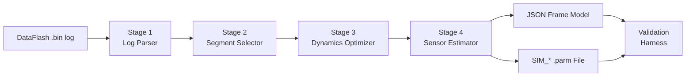
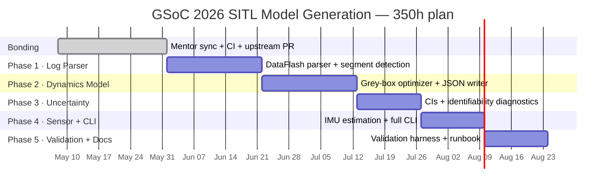

# GSoC 2026 Proposal: SITL Model Generation from Flight Data

---

## Contact Information

- **Name:** Aashrith Bandaru
- **Email:** bandaru6@illinois.edu
- **GitHub:** github.com/bandaru6
- **University:** University of Illinois Urbana-Champaign
- **Major:** B.S. Computer Science + B.S. Statistics (Dual Degree)
- **GPA:** 3.83 / 4.0
- **Year:** Sophomore (2nd year by summer 2026)
- **Location:** Fremont, CA (summer)

---

## Project

**Project Name:** SITL Model Generation from Flight Data

**Project Description:**

ArduPilot's Software-In-The-Loop simulator (SITL) is one of the most powerful tools in the
entire ArduPilot ecosystem. Developers use it to test new features, debug autopilot behavior,
and train autonomy algorithms on a regular computer without hardware. But there is a
fundamental problem: the physics models SITL uses are generic defaults, not tuned to any
specific vehicle.

To be concrete: a 5-inch racing quad and a heavy X8 octocopter fly completely differently in
the real world, but SITL treats them nearly the same with default parameters. The result is
a simulation that does not represent the real vehicle, which defeats the purpose of
simulation-based testing and introduces false confidence in algorithms validated only in
simulation.

**This project replaces manual parameter guessing with a data-driven pipeline.** Given a
real ArduPilot DataFlash flight log, the tool estimates key vehicle dynamics and sensor
parameters using grey-box system identification, and outputs two files: an updated SITL JSON
frame model and a SIM_* sensor parameter file. From a developer's perspective: run one
command on your flight log, get a SITL model that behaves like your vehicle.

Both outputs are directly loadable into ArduPilot's existing SITL infrastructure via
sim_vehicle.py and MAVProxy — no custom simulator required, no manual tuning needed.
The project also supports ArduPilot's dedicated SYSID flight mode, which injects chirp
frequency sweeps into control loops and logs synchronized response data, producing the
richest possible dataset for parameter estimation.

ArduPilot already has investment in this direction: SYSID mode documentation explicitly
lists "generating mathematical models for model generation" as a primary use case, and
ArduPilot ships a MATLAB/Simulink workflow (including scripts like `sid_pre.m` that read
SYSID DataFlash logs) for controller and plant modeling. This project builds the
Python-native, open-source equivalent — integrated directly with ArduPilot tooling.

*Mermaid alternative (renders natively on GitHub):*

---

## Deliverables

**Core deliverables (guaranteed):**

1. A Python CLI tool that parses a DataFlash .bin log and runs the full identification
   pipeline for multicopters
2. A fitted JSON frame model compatible with ArduPilot's multicopter SIM_Frame loader
3. A SIM_* .parm file for sensor parameters, loadable via MAVProxy or sim_vehicle.py
4. A fit report with parameter values, confidence intervals, identifiability diagnostics,
   and sim-vs-real validation metrics
5. Regression test suite in CI that guards against optimizer regressions

**Extended deliverables (target, scope confirmed with mentor during community bonding):**

6. Support for SYSID-mode chirp logs with frequency-domain validation
7. Full documentation and runbook: developer can go from raw .bin to running SITL with
   the fitted model in under 15 minutes

**Stretch deliverables:**

8. Cross-vehicle abstraction layer for future extension to planes and helicopters
9. Transfer function comparison for SYSID chirp validation
10. Cross-log generalization testing across multiple vehicles of the same type

---

## Alternate Projects

If SITL Model Generation were not available, I would consider the AI-Assisted Log Diagnosis
project, where my Statistics background maps directly to the anomaly detection and
time-series classification problem. My interest in this project is unambiguous — I have
already built working code, read the source files, and engaged with the mentor specifically
for it.

---

## Why I Am Interested in This Project

**The problem, in plain terms**

When you run SITL with default parameters and compare the output to real flight data, you
almost always see a gap. The simulated vehicle pitches too fast or too slow. The
throttle-to-thrust relationship is off. The gyroscope bias is wrong. Each gap traces back to
a specific physics or sensor parameter that was never tuned to the real vehicle.

Closing that gap is a parameter estimation problem: you have a model with unknown
coefficients, you have observations of the real system, and you want to find the coefficients
that make the model match the observations. This is formally the same as fitting any
statistical model to data — with the added complexity that the model is a nonlinear system
of differential equations, the data is noisy and irregularly sampled, and some parameters
are unidentifiable from a given dataset.

This is exactly the kind of problem I find genuinely interesting. My Statistics degree is not
just coursework for me; it is a lens through which I see engineering problems. When I read
about system identification, I see maximum likelihood estimation. When I look at IMU bias,
I see a latent variable that needs to be inferred. When I think about parameter confidence
intervals, I am thinking about what the Fisher information matrix tells us about how much
useful information the flight data actually contains.

I also enjoy problems where the hard part is not writing a model, but figuring out whether
the data actually justifies the conclusion. That is what identifiability analysis is: a formal
answer to "can we even estimate this from what we have?" This project needs that kind of
thinking at every stage.

**Why I am already operating in this space**

I work as an undergraduate researcher at UIUC's BLENDER Lab, where I build simulation
evaluation infrastructure for autonomous driving. My work involves:

- Writing C++ simulation components that replay real-world driving scenarios in a
  physics-based simulator
- Building trajectory rollout engines that compare predicted futures to ground truth
- Designing counterfactual scenario generation pipelines for causal inference
- Implementing evaluation metrics that measure how well simulated behavior matches
  real-world behavior — the same meta-problem this project addresses

The throughline to this proposal is direct: I have spent the last year thinking carefully
about sim-to-real gaps, how to quantify them, and what causes them. I have already built
the evaluation and comparison infrastructure that this project also requires. I am not
starting from scratch — I am applying the same pattern of thinking in a new domain.

I have also built production-quality tooling in this context: reproducible pipelines,
CI-guarded regression tests, and documented interfaces designed for a lab of multiple
contributors. That engineering discipline carries directly into the deliverables here.

**Pre-application work**

Before writing this proposal, I did the following:

1. Set up the ArduPilot SITL environment locally and ran sim_vehicle.py with a custom
   JSON frame model to verify the loading mechanism end-to-end
2. Read through SIM_Frame.cpp and SIM_Frame.h to catalog all JSON-loadable parameters
   and understand how ArduPilot computes thrust, drag, and rotational forces in simulation
3. Read the SYSID mode documentation to understand the chirp injection workflow and
   the SID log message format, including that SID records average IMU measurements taken
   directly from hardware without extra filtering — improving time alignment for identification
4. Written and tested a working DataFlash .bin parser using pymavlink.DFReader_binary
   that extracts hoverThrOut from CTUN.ThO, propExpo from MOT_THST_EXPO, PWM range
   from RCOU, and battery parameters from BAT messages, with correct handling of both
   old-format logs (TimeMS, ThO 0-1000 scale) and new-format logs (TimeUS, ThO 0-1 scale).
   Tested on a real .bin log, producing hoverThrOut = 0.387 and propExpo = 0.8
5. Posted on the ArduPilot forum in the GSoC 2026 category to introduce myself and get
   mentor feedback before submitting this proposal
6. Identified a scoped fix to pymavlink (issue #1033: parameter message handling in
   mavlogdump.py) and plan to submit it as a PR during community bonding

All code is at: github.com/bandaru6/gsoc-sitl-sysid

**Research that shaped the design**

Burri et al. (2020), "Identification of the Propeller Coefficients and Dynamic Parameters of
a Hovering Quadrotor From Flight Data" (IEEE RA-L) — the closest prior work to this project.
Their segmented grey-box optimization approach using short flight windows is the structural
baseline for Stage 3, and their parameter set maps almost directly onto ArduPilot's JSON
fields.

Tedaldi et al. (2014), "A Robust and Easy to Implement Method for IMU Calibration Without
External Equipment" (ICRA) — the static calibration method here directly informs Stage 4:
pre-arm stationary windows for bias estimation, flight windows for noise characterization.

Torrente et al. (2021), "Data-Driven MPC for Quadrotors" (IEEE RA-L, IROS) — demonstrates
that fitting dynamics to real flight data substantially outperforms hand-tuned models. Their
held-out validation methodology shaped how I structured the evaluation harness.

Ljung (1999), "System Identification: Theory for the User" — foundational treatment of
identifiability, prediction error methods, and the Cramer-Rao bound for parameter
uncertainty. Chapters 7 and 14 directly inform the uncertainty quantification in Stage 3.

---

## Proposed Architecture

The project is five sequential processing stages. Every stage has a clear input, a clear
output, and can be tested independently. Partial progress is always useful: a working parser
is valuable even without a working optimizer. The pipeline is designed to **degrade
gracefully** — if a parameter cannot be reliably estimated from the available data, the tool
will explicitly flag it with a plain-language warning rather than returning a misleading value.
The tool never silently fails.

**Algorithm stack (staged by complexity):**

*Baseline (core deliverable):*
- Robust NLLS with bounded constraints and Huber/soft-L1 loss for outlier robustness
- MAP regularization (priors on parameters) for under-excited regimes where the data
  cannot uniquely constrain all parameters
- Gauss-Newton approximate Hessian for confidence intervals; bootstrap for empirical CIs
- Cross-validation across log windows (fit on N-1, evaluate on held-out window)

*Advanced (stretch):*
- EKF/UKF augmented-state parameter refinement (offline replay)
- Frequency-domain transfer function comparison for SYSID chirp validation, complementing
  the existing ArduPilot WebTools SysID browser tool (which outputs transfer functions and
  state space models and could be used for visual validation alongside this pipeline)

### Stage 1: Log Parser and Time Alignment

**What it does:** ArduPilot logs multiple streams at different rates. IMU might log at
400 Hz, motor commands at 50 Hz, attitude at 25 Hz. All streams need to be resampled to
a common timebase and synchronized. This stage also handles real-world log messiness:
different time field names across firmware versions, missing messages, logging dropouts,
and multiple IMU instances.

**Key details:**
- pymavlink DFReader_binary with transparent handling of old-format (TimeMS, ThO 0-1000)
  and new-format (TimeUS, ThO 0-1) logs — already implemented and tested
- Message types extracted: ACC, GYR, RCOU, CTUN, ATT, BARO, BAT, PARM, SID (SYSID)
- Resample all streams to 50 Hz common timebase using linear interpolation for continuous
  signals and zero-order hold for discrete signals
- Detect flight phases: pre-arm static (IMU bias), hover (hoverThrOut, sensor noise),
  maneuver (inertia), forward-flight (drag), SYSID chirp (if SID messages present)
- Reject windows with EKF health failures, GPS dropouts, excessive vibration (VIBE), or
  insufficient signal excitation
- YAML-based message selection configuration; designed for multicopters first with
  abstractions for future extension to other vehicle types

**If key messages are absent:** the stage emits a specific warning identifying which message
type is missing and which parameter groups are unavailable as a result.

**Milestone 1:** Parser handles ≥3 different .bin logs across ≥2 firmware versions. Segment
detector correctly identifies hover windows on ≥2 real logs.

### Stage 2: Segment Selector

**What it does:** Not all parts of a flight are equally useful. A hover segment tells you a
lot about hover throttle but almost nothing about rotational inertia. A sharp rate step tells
you about inertia but not drag at speed. SYSID chirp logs are the richest possible source,
with rich controlled excitation designed specifically for identification. This stage finds
the windows most informative for each parameter group.

**Key details:**
- Classify each window as pre-arm static, hover, rate step, forward-flight, or SYSID chirp
- Compute excitation quality score per window; rank and select top N per parameter group
- Condition number check on regressor matrix to assess identifiability from each window
- SYSID chirp detection via SID messages: extracts injection axis, sweep frequency range,
  and aligned IMU response windows

### Stage 3: Grey-Box Dynamics Optimizer

**What it does:** Find the physics parameters that make the simulation most closely reproduce
what the real vehicle did. Grey-box means we keep the known physics structure and only
estimate the unknown coefficients — so results map directly to ArduPilot JSON fields
(verified against SIM_Frame.cpp) and remain physically interpretable.

**Key details:**
- scipy.optimize.least_squares with Huber/soft-L1 loss for outlier robustness
- Staged optimization: hoverThrOut from hover median (closed-form), rotational inertia
  from rate step windows (NLLS), mdrag_coef from forward-flight transitions (NLLS)
- Physical bounds on all parameters; soft Gaussian priors for regularization
- Gauss-Newton Hessian for CIs; bootstrap resampling for empirical CIs
- Condition number and correlation diagnostics: parameters with poor identifiability are
  flagged with plain-language warnings, not silently estimated

**Parameter mapping to ArduPilot JSON fields:**

| Estimated parameter | ArduPilot JSON field | Estimation method |
|--------------------|--------------------|------------------|
| Hover throttle | hoverThrOut | Median CTUN.ThO in hover |
| Thrust nonlinearity | propExpo | Logged MOT_THST_EXPO or fit |
| Rotational inertia | moment_of_inertia | NLLS on rate step windows |
| Momentum drag | mdrag_coef | NLLS on forward-flight windows |
| Rotor disc area | disc_area | Combined with thrust fit |
| Motor PWM range | pwmMin, pwmMax | Min/max RCOU across flight |
| Battery reference voltage | refVoltage | Median BAT.Volt in cruise |

**Milestone 2:** Optimizer converges with physically plausible values on ≥2 real logs.
JSON output loads into SITL without errors via sim_vehicle.py.

### Stage 4: Sensor Parameter Estimator

**What it does:** Even a perfect physics model will not match reality if the simulation uses
wrong IMU characteristics. ArduPilot SITL exposes SIM_ACC*_BIAS, SIM_GYR*_BIAS,
SIM_ACC*_RND, SIM_GYR*_RND, and SIM_ACC*_SCAL. This stage estimates them from the log.

**Key details:**
- Pre-arm static windows: accelerometer deviation from expected gravity gives ACC_BIAS;
  gyroscope mean gives GYR_BIAS
- Steady hover: signal variance gives noise proxy for ACC_RND and GYR_RND
- Scale estimation where flight profile supports it; skipped with explicit warning otherwise

**Milestone 3:** Sensor parameters estimated within physically reasonable range on ≥2 logs.
Full CLI runs end-to-end in under 60 seconds on a typical 5-minute log.

### Stage 5: Output Writers and Validation Harness

**What it does:** Write all estimated parameters to files ArduPilot SITL can use, close the
loop with a validation harness comparing the fitted model to held-out data, and produce a
fit report a developer can act on.

**Key details:**
- JSON serialization aligned to SIM_Frame field names and units verified against
  SIM_Frame.cpp; loaded into live SITL to verify end-to-end compatibility
- MAVProxy .parm format writer; parameters loadable via `param load` in standard SITL workflow
- Fit report: parameter table, CIs, identifiability warnings, validation metrics, usage guide
- Validation runner: replay fitted model in SITL against held-out log segments; compare to
  real log and ArduPilot defaults; generate side-by-side comparison plots
- pytest + GitHub Actions CI with full pipeline regression test on a sample log
- Modular code structure with documented interfaces, designed so ArduPilot community
  contributors can extend the tool after GSoC

---

## Risks and Scope Reduction Plan

| Risk | Mitigation |
|------|-----------|
| Weak identifiability on available logs | Restrict estimates to high-confidence parameters; warn explicitly on others; prioritize SYSID logs |
| Logs lack sufficient excitation for inertia | Shift primary validation to SYSID-mode or synthetic SITL logs with known ground truth |
| Sensor scale estimation unsupported | Deliver bias and noise only; document what flight maneuver is needed for scale |
| Cross-vehicle generality harder than expected | Focus on multicopters; document extension points for planes and helicopters |
| JSON field mapping is broader than expected | Prioritize 5 highest-impact fields (hoverThrOut, inertia, drag, PWM range, bias) |
| Scope slippage in later phases | 50-hour rolling buffer; each phase produces a usable standalone artifact |

If deliverables must be reduced, the order is: stretch → extended → core. The core five
deliverables are the minimum definition of success.

---

## Project Plan and Timeline

### Pre-Application Work (Already Completed)

- Cloned ArduPilot and built SITL locally from source
- Ran sim_vehicle.py with a custom JSON frame model to verify end-to-end loading
- Read and annotated SIM_Frame.cpp and SIM_Frame.h to map all JSON-loadable fields
- Read the SYSID mode documentation; understood SID message format and IMU averaging
- Written and tested log_to_model_params.py: a working DataFlash parser producing a
  SITL-compatible JSON from a real .bin log (hoverThrOut = 0.387, propExpo = 0.8),
  with correct old/new format handling
- Posted on the ArduPilot GSoC forum to introduce myself and get mentor feedback
- Identified pymavlink issue #1033 (parameter message handling in mavlogdump.py) as
  a scoped, directly relevant contribution to begin building a contribution record

All code is public at github.com/bandaru6/gsoc-sitl-sysid.

### Community Bonding (May 8 to June 1, not counted in 350 hours)

- Sync with the mentor on: which parameter groups are highest priority, whether ordinary or
  SYSID-mode logs should be the primary development baseline, where the tooling should live
  in the ArduPilot repository structure, and what quantitative targets are realistic given
  available log datasets
- Identify 3–5 real flight logs to use as development baselines; confirm with mentor
- Complete and submit pymavlink issue #1033 fix as a PR
- Set up GitHub Actions CI: lint (flake8), unit tests (pytest), sample log regression test
- Review existing ArduPilot system identification tooling (issue #22704, ArduPilot's
  existing MATLAB SYSID scripts) and document gaps this project fills
- Milestone: mentor alignment confirmed, CI running, upstream contribution in review

### Phase 1: Log Parser and Time Alignment (Weeks 1–3, 70 hours)

**Overview:** Build the data layer all subsequent stages depend on. Robustness is the
priority — every later stage is only as good as the data it receives.

**Tasks:**
- Extend existing parser to handle all relevant message types across firmware versions
- Time alignment: resample all streams to configurable common timebase
- Flight phase detection: pre-arm, hover, maneuver, forward-flight, SYSID chirp
- Quality filters: EKF health, GPS, VIBE, excitation checks
- Unit tests on both synthetic and real .bin logs

**Milestone 1 (end of Week 3):**
- Parser handles ≥3 different .bin logs covering ≥2 firmware versions without error
- Segment detector identifies hover windows correctly on ≥2 real logs
- All unit tests passing in CI

### Phase 2: Dynamics Model and Parameter Optimizer (Weeks 4–6, 80 hours)

**Overview:** Implement the grey-box multirotor dynamics model and staged nonlinear least
squares optimizer. The forward model mirrors ArduPilot's SIM_Frame physics so fitted
parameters write directly to JSON without unit conversion.

**Tasks:**
- Forward dynamics model: thrust curve, body drag, Newton-Euler rotational dynamics,
  motor lag (first-order filter)
- Map every model parameter to its ArduPilot JSON field; verify by loading into live SITL
- Staged optimizer: hoverThrOut (closed-form), rotational inertia (NLLS on rate steps),
  mdrag_coef (NLLS on forward-flight transitions)
- Physical bounds on all parameters; JSON writer

**Milestone 2 (end of Week 6):**
- Forward model reproduces ArduPilot SITL physics within 5% on synthetic SITL-generated
  logs (ground truth known)
- Optimizer converges on ≥2 real logs with physically plausible values
- JSON output loads into SITL without errors

### Phase 3: Uncertainty Quantification and Identifiability Diagnostics (Weeks 7–8, 70 hours)

**Overview:** The optimizer produces point estimates without uncertainty. This phase adds
the statistical layer that makes the tool trustworthy. If someone provides a hover-only log
and asks for an inertia estimate, the tool should not silently return an unconstrained
number — it should warn the user exactly what flight data is needed to fix it.

**Tasks:**
- Gauss-Newton approximate Hessian for covariance estimation
- Bootstrap CIs (100–200 resamples across log windows)
- Condition number and pairwise correlation diagnostics
- MAP regularization with soft priors for under-excited regimes
- Plain-language identifiability warnings in the fit report

**Milestone 3 (end of Week 8):**
- CIs computed for all parameters on ≥2 real logs
- Identifiability warnings correctly trigger on hover-only logs for inertia parameters
- Optimizer stable across 5 different test logs (no NaN, no divergence)

### Phase 4: Sensor Parameter Estimation and Full CLI (Weeks 9–10, 40 hours)

**Overview:** Extend the pipeline to estimate IMU sensor parameters and integrate everything
into a single CLI. At the end of this phase, the complete tool is functional.

**Tasks:**
- Pre-arm static window detection; ACC and GYR bias estimation
- Noise estimation from hover windows; scale estimation where flight profile supports it
- .parm file writer in MAVProxy format
- fit_report.txt: parameter table, CIs, validation metrics, identifiability warnings
- Single CLI entry point: `python3 log_to_model_params.py flight.bin --output-dir ./out`

**Milestone 4 (end of Week 10):**
- Full CLI produces JSON + .parm + fit_report.txt in under 60 seconds on a typical
  5-minute log
- All output files load into SITL without errors

### Phase 5: Validation Harness, Documentation, and SYSID Polish (Weeks 11–12, 40 hours)

**Overview:** Close the loop with a rigorous validation harness and complete documentation.

**Tasks:**
- Validation runner: replay fitted model in SITL against held-out segments; compare to
  real log and ArduPilot defaults; generate side-by-side comparison plots
- Regression tests in CI: assert full pipeline on sample log produces metrics better than
  default parameters
- Complete documentation: quick-start runbook, API reference, output parameter explanations,
  recommended flight profile, troubleshooting guide
- SYSID polish: dedicated SID message parsing, frequency-domain validation metrics

**Milestone 5 (end of Week 12):**
- Validation shows measurable RMS attitude error reduction vs. default parameters on
  held-out segments from ≥2 real logs (exact thresholds confirmed with mentor during
  community bonding based on available datasets)
- Regression tests passing in CI
- Documentation complete: developer can follow runbook in under 15 minutes

### Timeline Summary

*Mermaid alternative:*

| Phase | Weeks | Hours | Key Deliverable | Quantitative Milestone |
|-------|-------|-------|-----------------|----------------------|
| Community Bonding | Pre-coding | (not counted) | Mentor sync, CI, upstream PR | pymavlink fix submitted |
| 1: Log Parser | 1–3 | 70h | Robust parser + segment detection | 3 logs parsed; CI passing |
| 2: Dynamics Model | 4–6 | 80h | Grey-box optimizer + JSON writer | JSON loads in SITL |
| 3: Uncertainty | 7–8 | 70h | CIs + identifiability diagnostics | Warnings trigger on hover-only logs |
| 4: Sensor + CLI | 9–10 | 40h | IMU bias/noise + full CLI | End-to-end in under 60s |
| 5: Validation + Docs | 11–12 | 40h | Validation harness + runbook | Measurable error reduction vs default |
| Buffer | Rolling | 50h | Risk mitigation, mentor feedback | Absorbed per phase as needed |
| **Total** | **12 weeks** | **350h** | **End-to-end toolchain** | **All core milestones met** |

Each phase produces a standalone usable artifact. Reducing weekly hours later in the project
extends the timeline without breaking the pipeline or losing prior work.

---

## Performance Evaluation

**Model quality metrics (on held-out log segments, not used in optimization):**

| Metric | Definition | Target |
|--------|-----------|--------|
| RMS attitude error | Mean angular distance between real and simulated attitude (degrees) | Measurable reduction vs ArduPilot defaults; exact threshold confirmed with mentor |
| RMS body-rate error | RMS of angular rate residual (rad/s) | Stable reduction across hover and maneuver segments |
| RMS acceleration error | RMS of body-frame accel residual (m/s²) | Reduced on hover and forward-flight |
| PSD mismatch | Welch PSD distance between fitted sim and real acceleration | Reduced frequency-domain mismatch |
| Frequency-domain fit | Bode magnitude/phase error vs SYSID chirp data (when available) | Reduced transfer-function mismatch |
| CI coverage | Fraction of parameters with finite confidence intervals | 100% on SYSID-mode logs |
| Cross-log generalization | Validation error increase when fitting on log A, testing on log B | Bounded; no worse than 20% degradation |

I will benchmark against ArduPilot default parameters as the baseline on the same held-out
segments. Exact numerical improvement targets will be confirmed with the mentor during
community bonding once we have established baseline performance on the agreed log datasets.
Quantitative claims in this proposal are intentionally stated as "measurable reduction"
rather than hard numbers because I have not yet run the baseline experiments — I expect to
do that during community bonding and would rather give the mentor accurate numbers than
impressive-sounding guesses.

**Pipeline robustness:**
- No NaN outputs or divergence on any valid ArduPilot .bin log
- Complete in under 60 seconds for a 5-minute log on a standard laptop
- Identifiability warnings fire correctly on under-excited logs

**Datasets:**
- Primary: 3–5 publicly available .bin logs from the ArduPilot forum and test suite,
  covering ≥2 vehicle configurations
- Ground truth: synthetic SITL-generated logs with known parameters (rigorous accuracy test)
- SYSID: chirp logs from mentor if available; otherwise generated via SITL SYSID mode

---

## Technical Skills

**Python:** My primary language with three years of research-grade use including
optimization scripts, time-series analysis, and pipeline engineering. I use numpy and scipy
daily — specifically scipy.optimize.least_squares (including trust-region-reflective and
Levenberg-Marquardt backends), condition number computation, and Jacobian-based covariance
estimation. Extensive pandas experience for time-series data.

**C++:** Two years of experience including ongoing work writing simulation components and
trajectory rollout code at BLENDER Lab. I can read and navigate the ArduPilot C++
codebase — I have already done so for SIM_Frame.cpp and related files.

**Other tools:** Git (daily use), GitHub Actions CI, pymavlink (used in existing parser),
pytest, matplotlib for scientific visualization.

**For this project specifically, already completed before this proposal:**
- Set up ArduPilot SITL build environment; verified sim_vehicle.py with custom JSON
- Written and tested a working DataFlash .bin parser with correct output on a real log
- Read SIM_Frame.cpp to understand the exact JSON field semantics and units
- Fixed old-format vs new-format TimeMS/TimeUS and ThO scaling issues in the parser
- Produced hoverThrOut = 0.387 and propExpo = 0.8 from a real flight log

---

## Code Samples

**Working log parser (pre-application work):**

github.com/bandaru6/gsoc-sitl-sysid/blob/main/Tools/scripts/log_to_model_params.py

This script parses a real ArduPilot DataFlash .bin log, extracts hoverThrOut from CTUN.ThO
(with normalization for both log format versions), propExpo from MOT_THST_EXPO, PWM range
from RCOU messages, and battery parameters from BAT messages. It outputs a SITL-compatible
JSON frame model. Tested on a real .bin log; produces hoverThrOut = 0.387, propExpo = 0.8.
The old/new format compatibility handling (get_timestamp() helper) is a real engineering
problem encountered and solved during pre-application work.

---

## Open Source Experience and Ecosystem

My open-source contribution history is recent but concrete. Before submitting this proposal:
working parser tested on real data, CI infrastructure set up, engagement with the mentor on
the ArduPilot forum, and a scoped upstream fix (pymavlink #1033) planned for community
bonding.

I have been a close reader of the relevant ArduPilot codebase: sim_vehicle.py, SIM_Frame.cpp
and SIM_Frame.h, the DataFlash log message reference, the SYSID mode documentation, and open
issues related to system identification (#22704) and logging (#15656). I have also reviewed
the ArduPilot WebTools SysID browser tool, which provides transfer function and state space
outputs from SYSID logs and is a natural visual complement to the parameter export this
project produces.

**Collaboration opportunities in the ecosystem:**

This project sits naturally adjacent to several active ArduPilot-adjacent repositories. I
plan to align output formats with ArduPilot/WebTools (complementing, not duplicating, its
transfer function outputs), contribute parser improvements back to pymavlink, and provide
reference model JSONs or generation tooling that could be included under SITL_Models. These
are not necessary for GSoC success but represent the natural next contributions after core
deliverables are complete.

I want to be a contributor to ArduPilot, not just a GSoC student. After GSoC I plan to
extend cross-vehicle support, richer SYSID frequency-domain validation, and upstream
utilities to the ArduPilot tools directory.

---

## Background and Education

- **University:** University of Illinois Urbana-Champaign
- **Major:** B.S. Computer Science + B.S. Statistics (dual degree)
- **Year:** Sophomore (2 years completed by summer 2026)
- **GPA:** 3.83 / 4.0
- **Relevant coursework:** Computational Linear Algebra, Statistical Computing, Applied
  Machine Learning, Data Structures and Algorithms, Probability Theory, Numerical Methods

**Research Experience:**

I work as an undergraduate researcher at UIUC's BLENDER Lab, building simulation evaluation
infrastructure for autonomous driving. My work involves:

- Writing C++ simulation components that replay real-world driving scenarios in a
  physics-based simulator
- Building trajectory rollout engines that generate predicted futures and compare them to
  ground truth
- Designing counterfactual scenario generation pipelines for causal inference
- Implementing evaluation metrics that measure how well simulated behavior matches
  real-world behavior

This is not adjacent experience — I already operate at the interface of simulation realism,
trajectory rollout, model evaluation, and real-world comparison. The problem structure is
the same. The domain is different.

I am working with my advisor toward a contribution on simulation evaluation methodology for
autonomous systems. I would be interested in co-authoring a paper about automated SITL
calibration from flight logs if the mentor is open to it.

---

## GSoC Experience

I have not participated in a previous Google Summer of Code.

I am applying only to this project.

**Why GSoC:**

Most undergraduate research involves working on someone else's problem with someone else's
code. GSoC is different: I would own a real deliverable that ArduPilot developers will use
to build better simulations for real vehicles. The combination of technical depth (system
identification is genuinely hard), community engagement (I have already been talking to the
mentor), and direct utility (every SITL user benefits when simulation fidelity improves)
makes this the most compelling way I can imagine spending a summer.

**Why ArduPilot specifically:**

ArduPilot powers hundreds of thousands of vehicles worldwide. Its SITL simulator is used by
virtually every ArduPilot developer for testing and validation. A tool that makes SITL more
faithful to real vehicles has a multiplier effect across the entire ecosystem.

But beyond scale: ArduPilot is the right platform for this project because of its mature
SITL infrastructure, active SYSID mode with time-synchronized log data specifically designed
for model generation, and the real-world flight log corpus available for development. This
is a place where a parameter estimation tool can become something the community actually
uses in their daily workflow — not a research prototype that sits in a GitHub repo. The fact
that ArduPilot already ships MATLAB SYSID scripts and has open issues about this exact
problem tells me the community wants this and has been thinking about it.

I intend to keep contributing after GSoC. Cross-vehicle support, richer SYSID validation,
and upstreaming utilities to the tools directory are the natural next steps.

---

## Summer Plans

- **Location:** Fremont, CA (summer)
- **Availability:** 30 hours per week as the baseline, with capacity to push harder during
  the optimizer and validation phases where my background is strongest
- **Conflicts:** No summer classes. One 3–4 day family trip scheduled to avoid milestone
  deadlines.
- **If a summer professional opportunity arises:** I would transition to the extended coding
  period at 15 hours per week, continuing into fall 2026, completing all deliverables by
  end of calendar year 2026. The phased architecture is explicitly designed to support this:
  each phase produces a standalone usable artifact, so reduced weekly hours extends the
  timeline without breaking the pipeline or losing prior work. I am fully committed to
  seeing this project through to completion regardless of timeline.
- I plan to provide regular progress updates and share intermediate results early to ensure
  alignment and incorporate mentor feedback throughout development.

---

## Coding Period

I prefer the standard 12-week coding period. The 350-hour scope maps to 12 weeks at 25–30
hours per week with a 50-hour rolling buffer for mentor feedback and unexpected blockers.

If the mentor prefers the extended timeline (up to 22 weeks at reduced hours), I am equally
comfortable with that structure and would use the additional time for cross-vehicle testing,
SYSID frequency-domain validation, and documentation improvements.

I expect to iterate on both scope and implementation details throughout based on mentor
feedback, and I have structured the project so each stage can be adjusted without breaking
the overall pipeline.

---

## In Two Sentences, Why Should You Take Me?

I have already written working code, read the relevant source files and papers, posted on
the forum, and identified an upstream fix to contribute before the coding period starts —
I am not applying to learn what SITL is, I am applying to spend 350 hours making it better.
My Statistics degree means I will spend the hardest parts of this project not just writing
an optimizer, but understanding when its output can be trusted and when the data simply does
not contain enough information to estimate what we are asking for.
