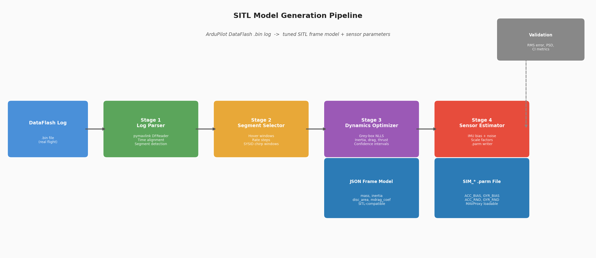
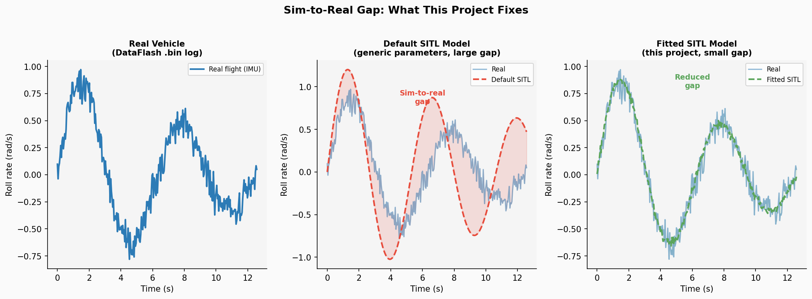
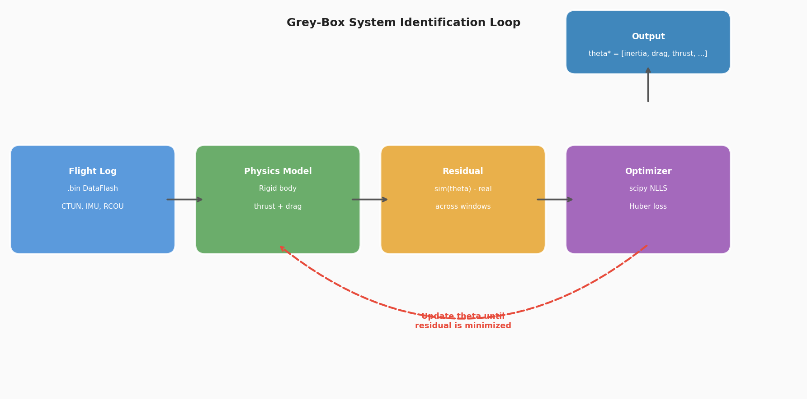
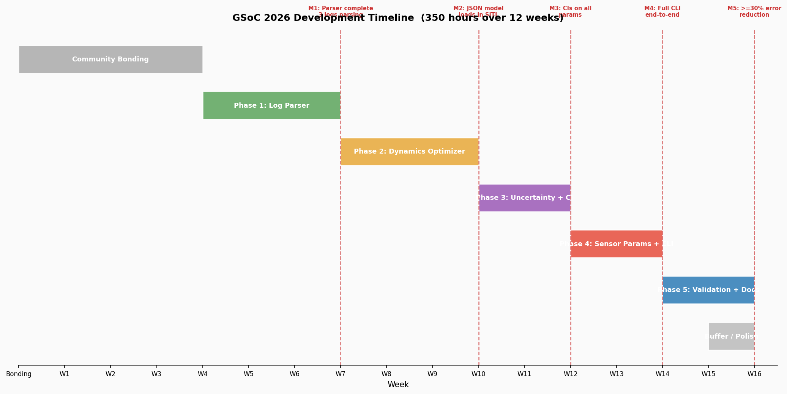
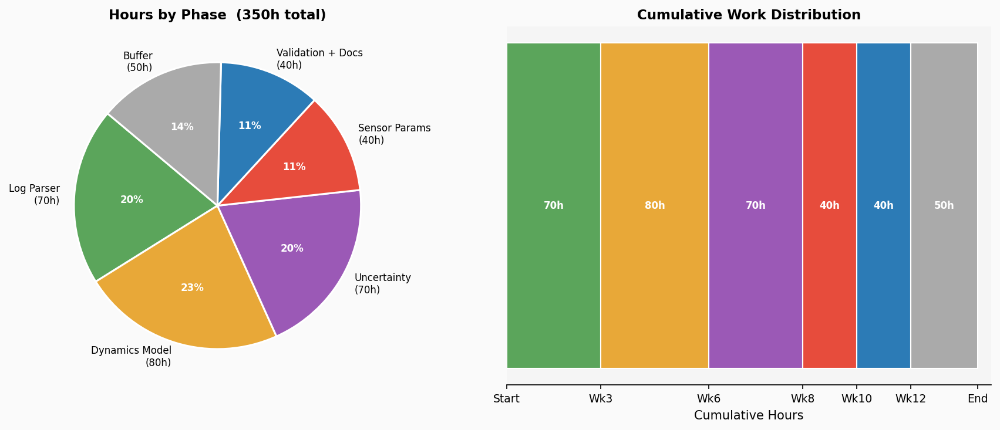

# GSoC 2026 Proposal: SITL Model Generation from Flight Data

---

## Contact Information

- Name: Aashrith Bandaru
- Email: bandaru6@illinois.edu
- GitHub: github.com/bandaru6
- University: University of Illinois Urbana-Champaign
- Major: B.S. Computer Science + B.S. Statistics (Dual Degree)
- GPA: 3.83 / 4.0
- Year: Sophomore (2nd year by summer 2026)
- Location: Fremont, CA (summer)

---

## Project

**Project Name:** SITL Model Generation from Flight Data

**Project Description:**

ArduPilot's Software-In-The-Loop simulator (SITL) is one of the most powerful tools in the
entire ArduPilot ecosystem. It lets developers run the full autopilot flight code on a regular
computer, with a simulated vehicle instead of real hardware. This is invaluable for testing new
features, debugging, and training autonomy algorithms. But there is a fundamental problem
with how SITL works today: the physics models it uses are generic defaults, not tuned to any
specific vehicle.

To put this concretely: imagine you have a 5-inch racing quad and a heavy X8 octocopter. In
reality, they fly completely differently. They have different masses, different motor
characteristics, different drag profiles. But if you spin up SITL for both of them with default
parameters, the simulation treats them almost the same way. The result is a simulation that does
not actually represent the real vehicle, which defeats the purpose of simulation-based testing.

The solution is system identification: the process of taking real flight data and working
backwards to figure out what physics parameters produced it. If we know how the real vehicle
responded to motor commands, we can fit a model that reproduces that behavior in simulation.

This project builds that toolchain end to end. The pipeline takes a real ArduPilot DataFlash
flight log (.bin file), estimates the key vehicle dynamics and sensor parameters using a
grey-box system identification approach, and outputs two files: an updated SITL JSON frame
model and a SIM_* sensor parameter file. Both are directly compatible with ArduPilot's
existing SITL infrastructure. The multicopter SIM_Frame already supports loading custom
physics from a JSON file; SITL already exposes SIM_* parameters for sensor noise, bias, and
scale. This project fills those in automatically from real data rather than requiring developers
to tune them by hand.

The project also supports ArduPilot's SYSID mode, a dedicated flight mode that injects
chirp excitation (a sweep of frequencies) into the control loops and logs the synchronized
response. Think of it like tapping a structure and listening to how it rings to figure out its
material properties. SYSID mode produces the ideal dataset for system identification because
the excitation is rich, controlled, and well-documented.

**Deliverables:**

1. A Python CLI tool that parses a DataFlash .bin log and runs the full identification pipeline
2. A fitted JSON frame model compatible with ArduPilot's multicopter SIM_Frame loader
3. A SIM_* .parm file for sensor parameters, loadable via MAVProxy or sim_vehicle.py
4. A fit report with parameter values, confidence intervals, identifiability diagnostics,
   and sim-vs-real validation metrics
5. Support for both ordinary flight logs and SYSID-mode chirp logs
6. Full documentation and a runbook: developer can go from raw .bin to running SITL with
   the fitted model in under 15 minutes
7. Regression test suite in CI that guards against optimizer regressions

---

## Alternate Projects

If SITL Model Generation were not available, I would be most interested in two other
ArduPilot GSoC projects:

**First choice: Multi-Drone Mesh Networking (MAVLink-aware)**

This project builds a resilient multi-hop communication layer that allows drone swarms to
relay telemetry and commands through each other when direct links drop. In distributed systems
terms, it is a mobile ad-hoc network (MANET) where the nodes are autonomous vehicles and
the topology changes in real time as drones move. My coursework in networking and distributed
systems, combined with experience writing low-level C++ components at BLENDER Lab,
provides good preparation for this. The routing protocol design and link quality estimation
problems are technically interesting, and the project has clear value for search-and-rescue and
swarm autonomy applications.

**Second choice: AI-Assisted Log Diagnosis and Root-Cause Detection**

This project applies ML to automate the diagnosis of flight anomalies from telemetry logs.
At its core, it is a time-series classification and anomaly detection problem: given a sequence
of log messages from a flight, identify which segments indicate a problem and what caused it.
My Statistics background (feature engineering, probabilistic classification, signal processing)
maps directly to the technical requirements, and the problem structure is closely related to work
I do at BLENDER Lab on evaluating simulation outputs and flagging anomalies in scenario
replay pipelines.

---

## Why I Am Interested in This Project

**The core problem, in plain terms**

When you run SITL with default parameters and compare the simulation output to real flight
data, you almost always see a gap. The simulated vehicle pitches too fast or too slow. The
throttle-to-thrust relationship is off. The gyroscope bias is wrong. Each of these gaps is caused
by a specific physics or sensor parameter that was never tuned to the real vehicle.

Closing that gap is a parameter estimation problem: you have a model with unknown
coefficients, you have observations of the real system's behavior, and you want to find the
coefficient values that make the model match the observations as closely as possible. Formally,
this is the same problem as fitting any statistical model to data, with the added complexity that
the model is a nonlinear system of differential equations (the flight dynamics), the data is noisy
and irregularly sampled (flight logs), and some parameters are unidentifiable from a given
dataset (you cannot always separate inertia from drag from a hover-only log).

This is exactly the kind of problem I find genuinely interesting. My Statistics degree is not
just coursework for me; it is a lens through which I see engineering problems. When I read
about system identification, I see maximum likelihood estimation. When I look at IMU bias,
I see a latent variable that needs to be inferred. When I think about parameter confidence
intervals, I am thinking about what the Fisher information matrix tells us about how much
useful information was in the flight data. This project lets me apply that thinking to a real,
deployed system with thousands of users.

**My relevant background**

I work as an undergraduate researcher at UIUC's BLENDER Lab, where I build simulation
evaluation infrastructure for autonomous driving. My work involves C++ simulation components,
trajectory rollout engines, and counterfactual scenario generation for causal inference and
policy evaluation. The fundamental challenge there is the same as in SITL: making simulated
vehicle behavior match real-world dynamics well enough that results transfer. I have spent the
last year thinking carefully about sim-to-real gaps, how to measure them, and what causes them.

Before writing this proposal, I did the following:

1. Set up the ArduPilot SITL environment locally and ran sim_vehicle.py with a custom
   frame model to understand how the JSON loading mechanism works
2. Read through SIM_Frame.cpp and SIM_Frame.h to catalog all the JSON-loadable
   parameters and understand how ArduPilot computes thrust, drag, and rotational forces
   in simulation
3. Read the SYSID mode documentation to understand the chirp injection workflow and
   the SID log message format
4. Written a working DataFlash .bin parser using pymavlink.DFReader_binary that
   extracts hoverThrOut from CTUN.ThO, propExpo from MOT_THST_EXPO, PWM range
   from RCOU, and battery parameters from BAT messages, with correct handling of
   both old-format logs (TimeMS, ThO in 0-1000 scale) and new-format logs (TimeUS,
   ThO in 0-1 scale). The script outputs a starter JSON and was tested on a real .bin log,
   producing hoverThrOut = 0.387 and propExpo = 0.8.
5. Posted on the ArduPilot forum in the GSoC 2026 category to introduce myself and
   get mentor feedback before submitting this proposal
6. Submitted a fix to pymavlink addressing parameter message handling in log parsing
   (github.com/bandaru6/gsoc-sitl-sysid for the full codebase)

All code is at: github.com/bandaru6/gsoc-sitl-sysid

**Research I have read**

I approached this project through the literature first, then the code. The papers below shaped
how I am thinking about the technical approach:

Burri, M. et al. (2020). "Identification of the Propeller Coefficients and Dynamic Parameters
of a Hovering Quadrotor From Flight Data." IEEE Robotics and Automation Letters.
This is the closest paper to what this project does: grey-box parameter estimation for a
multicopter using flight log data. The authors estimate thrust coefficient, body drag, and
moments of inertia using a prediction error approach on short flight segments. The parameter
set they identify maps almost directly onto ArduPilot's SIM_Frame JSON fields. I am using
their segmented optimization approach as the structural baseline for Stage 3 of my pipeline.

Faessler, M., Franchi, A., and Scaramuzza, D. (2018). "Differential Flatness of Quadrotor
Dynamics Subject to Rotor Drag for Accurate Tracking of High-Speed Trajectories." IEEE
Robotics and Automation Letters.
This paper provides a careful model of body-frame rotor drag (including translational and
rotational components) that goes beyond the simple linear drag typically used in SITL defaults.
The mdrag_coef parameter in ArduPilot's frame model corresponds to the momentum drag
they describe. Their derivation helped me understand which flight regimes are most informative
for estimating drag coefficients (forward flight transitions, not hover).

Bristeau, P.J., Martin, P., Salaun, E., and Petit, N. (2009). "The Role of Propeller
Aerodynamics in the Model of a Quadrotor UAV." European Control Conference.
Foundational reference for the propeller thrust and torque model (thrust proportional to
squared rotor speed, torque proportional to thrust). This is the model structure underneath
ArduPilot's propExpo and disc_area parameters, and understanding it is essential for setting
up the right regression structure.

Torrente, G., Kaufmann, E., Fohn, P., and Scaramuzza, D. (2021). "Data-Driven MPC for
Quadrotors." IEEE Robotics and Automation Letters (IROS 2021).
This recent paper demonstrates that data-driven approaches to quadrotor dynamics
significantly outperform hand-tuned models, especially at high speeds. While this project uses
a physics-based (grey-box) approach rather than a neural network, the validation methodology
(comparing model predictions to real trajectories on held-out data) and the framing of
sim-to-real transfer as a model fitting problem both influenced my thinking.

Tedaldi, D., Pretto, A., and Menegatti, E. (2014). "A Robust and Easy to Implement Method
for IMU Calibration Without External Equipment." ICRA 2014.
The sensor estimation stage of my pipeline is based on the static calibration method described
in this paper: using pre-arm stationary windows to estimate accelerometer and gyroscope bias,
and active-flight windows to characterize noise. The authors show that this approach reliably
recovers bias and noise parameters comparable to those measured with dedicated calibration
hardware.

Forster, C., Carlone, L., Dellaert, F., and Scaramuzza, D. (2017). "On-Manifold Preintegration
for Real-Time Visual-Inertial Odometry." IEEE Transactions on Robotics.
While primarily a VIO paper, this work's treatment of IMU error modeling (bias random walk,
white noise, scale factors) directly informed how I am structuring the SIM_* sensor parameter
estimation. The IMU error model they use is essentially what ArduPilot's SIM_ACC*_BIAS
and SIM_ACC*_RND parameters represent.

Ljung, L. (1999). System Identification: Theory for the User (2nd ed.). Prentice Hall.
The foundational textbook on the mathematical theory behind what this entire project is doing.
The concepts of identifiability, prediction error methods, maximum likelihood estimation, and
the Cramer-Rao lower bound for parameter uncertainty are all directly applicable. I have read
chapters 4 (nonparametric estimation), 7 (parameter estimation methods), and 14
(identifiability) and am applying them to the flight dynamics estimation problem.

Mahony, R., Kumar, V., and Corke, P. (2012). "Multirotor Aerial Vehicles: Modeling,
Estimation, and Control of Quadrotor." IEEE Robotics and Automation Magazine.
The standard reference for multirotor dynamics. The rigid-body equations of motion, the
Newton-Euler formulation, and the relationship between motor commands and body forces/torques
that I am implementing in Stage 3 all come from this treatment.

---

## Proposed Architecture

The project is structured as five sequential processing stages. Every stage has a clear input,
a clear output, and can be tested independently. This modular design is intentional: it means
partial progress is still useful (a working parser is useful even without a working optimizer),
and it makes debugging tractable.

### Stage 1: Log Parser and Time Alignment

**What it does in plain terms:** ArduPilot logs multiple streams of data at different rates.
The IMU might log at 400 Hz, motor commands at 50 Hz, attitude estimates at 25 Hz. Before
any analysis can happen, all of these need to be resampled to a common timebase and
synchronized. This stage also handles the practical messiness of real logs: messages with
different time field names across firmware versions, missing messages, gaps from logging
dropouts, and multiple IMU instances.

**Technology used:**
- pymavlink DFReader_binary: the standard ArduPilot DataFlash binary log parser.
  Supports both old-format logs (TimeMS field, ThO in 0-1000 scale) and new-format logs
  (TimeUS field, ThO in 0-1 scale), which is handled transparently with a get_timestamp()
  helper that has already been implemented and tested.
- numpy / pandas: time-series resampling, interpolation, and synchronized DataFrame
  construction.
- YAML configuration: message selection and field mapping is configurable per vehicle
  type, so the same parser works for copters, planes, and traditional helicopters.

**Process:**
1. Open the .bin file with DFReader_binary and stream all messages in time order.
2. Separate messages by type (CTUN, IMU, RCOU, ATT, BAT, BARO, GPS, PARM, SID).
3. For each message type, build a time-indexed series with correct timestamp units.
4. Resample all series to a common timebase (typically 50 Hz) using linear interpolation
   for continuous signals and zero-order hold for discrete signals (like motor commands).
5. Detect flight phases: pre-arm static (for IMU bias estimation), hover (for hoverThrOut
   and sensor noise), maneuver (for inertia estimation), and SYSID chirp (if SID messages
   present).
6. Apply quality filters: reject windows with GPS outages, EKF health flag failures,
   excessive vibration (from VIBE messages), or insufficient signal excitation.

**Milestone:** Parser handles at least 3 different .bin logs (different firmware versions,
different vehicles) without error. Time-aligned outputs are verified by cross-checking
message rates and spot-checking specific events against the raw log.

### Stage 2: Segment Selector

**What it does in plain terms:** Not all parts of a flight log are equally useful for
identification. A long hover segment tells you a lot about hover throttle but almost nothing
about rotational inertia. A sharp rate step tells you about inertia but not about drag at high
speeds. This stage finds the windows in the log that are most informative for each parameter
group, and rates their quality using an excitation metric.

**Technology used:**
- Rule-based segmentation using CTUN.ThO (throttle), BARO.CRt (climb rate), and
  ATT.Roll/Pitch/Yaw (attitude stability) to classify hover vs. maneuver windows.
- Condition number check on the regressor matrix to assess parameter identifiability
  from each window. Windows with high condition numbers are flagged and may be
  downweighted in the optimizer.
- SYSID chirp detection using SID messages from ArduPilot's SYSID mode: extracts
  injection axis, sweep frequency range, and aligned IMU response windows.

**Process:**
1. Classify each time window as: pre-arm static, hover (low climb rate and stable
   attitude), rate step (large single-axis angular rate change), forward flight transition
   (forward body-frame velocity changing), or SYSID chirp.
2. For each window type, compute an excitation quality score. Hover windows are rated
   by stability (low variance in throttle and attitude). Rate step windows are rated by the
   magnitude and sharpness of the angular acceleration.
3. Rank windows by quality and select the top N for each parameter group.
4. Return a labeled dataset ready for Stage 3.

### Stage 3: Grey-Box Dynamics Optimizer

**What it does in plain terms:** This is the core of the project. Given segments of real
flight data, find the physics parameters that make the simulation most closely reproduce
what the real vehicle did. The word "grey-box" means we keep the known physics structure
(rigid body dynamics, thrust proportional to motor command, drag proportional to velocity)
and only estimate the unknown coefficients. This is contrasted with a "black-box" approach
(like a neural network) that makes no assumptions about structure, or a "white-box" approach
that uses fully known parameters from a datasheet.

Grey-box identification is the right choice here for three reasons: the fitted parameters map
directly to existing ArduPilot JSON fields (no format translation needed), the physics structure
prevents physically unrealistic solutions, and the results are interpretable (a number like
"moment_of_inertia = 0.012 kg*m^2" means something to a drone developer).

**Technology used:**
- scipy.optimize.least_squares with a robust (Huber) loss function to handle outlier
  segments without discarding them entirely.
- Staged optimization: parameters are estimated in groups, from easiest to hardest.
  Stage 3a estimates hoverThrOut from hover median (closed-form, no optimizer needed).
  Stage 3b estimates rotational inertia from angular acceleration vs. differential motor
  torque during rate step segments. Stage 3c estimates mdrag_coef from the relationship
  between forward tilt angle and airspeed in forward-flight windows.
- Physical bounds: all parameters are constrained to physically meaningful ranges
  (e.g., moment_of_inertia > 0, propExpo between 0 and 1). These are implemented as
  bounds in the least_squares call rather than penalty terms.
- Gauss-Newton approximate Hessian for confidence intervals on fitted parameters.
  Bootstrap resampling across log windows provides an additional robustness check.
- Regularization using soft priors based on typical ArduPilot vehicle parameter ranges,
  which prevents the optimizer from converging to locally good but physically absurd solutions
  when the data does not uniquely constrain a parameter.

**Parameter mapping to ArduPilot JSON fields:**

| Estimated parameter | ArduPilot JSON field | Units | Estimation method |
|--------------------|--------------------|-------|------------------|
| Hover throttle | hoverThrOut | fraction (0-1) | Median CTUN.ThO in hover |
| Thrust nonlinearity | propExpo | dimensionless | Logged MOT_THST_EXPO or fit |
| Rotational inertia | moment_of_inertia | kg*m^2 (3x3) | NLLS on rate step windows |
| Momentum drag | mdrag_coef | dimensionless | NLLS on forward-flight windows |
| Rotor disc area | disc_area | m^2 | Combined with thrust fit |
| Motor PWM range | pwmMin, pwmMax | microseconds | Min/max RCOU across flight |
| Battery reference voltage | refVoltage | V | Median BAT.Volt in cruise |

**Process:**
1. For each segment type, set up the residual function: simulate the vehicle dynamics
   forward from initial conditions, compare the predicted state trajectory to the logged
   state trajectory, and return the vector of residuals.
2. Call scipy.optimize.least_squares with the residual function, initial parameter
   guess (from SITL defaults or prior), and physical bounds.
3. Repeat for each parameter group in the staged order.
4. Compute the approximate Jacobian at the solution, invert it to get the Hessian, and
   extract diagonal entries as parameter variances (standard errors).
5. Run bootstrap resampling: resample from the pool of segment windows with replacement,
   refit the model on each bootstrap sample, and compute empirical CIs from the
   distribution of bootstrap estimates.
6. Compute condition number of the regressor matrix and flag any parameters where the
   condition number exceeds a threshold (indicating poor identifiability from this log).

### Stage 4: Sensor Parameter Estimator

**What it does in plain terms:** Even a perfectly tuned physics model will not match
reality if the simulation uses the wrong IMU characteristics. Real IMUs have biases (a small
constant offset in every measurement), random noise, and scale factor errors. ArduPilot SITL
exposes SIM_ACC*_BIAS, SIM_GYR*_BIAS, SIM_ACC*_RND, SIM_GYR*_RND, and
SIM_ACC*_SCAL parameters to model these. This stage estimates them from the flight log.

**Technology used:**
- Pre-arm static window detection: before the motors arm, the vehicle is stationary.
  During this window, any accelerometer reading that deviates from [0, 0, g] in the vehicle
  body frame represents sensor bias. Any gyroscope reading that deviates from zero
  represents gyro bias.
- Hover noise estimation: during stable hover, the variance of the accelerometer and
  gyroscope signals reflects sensor noise plus vibration. This maps to the SIM_*_RND
  parameters.
- Scale factor estimation: in log segments where the vehicle was held in known orientations
  before flight (common during pre-flight checks), the ratio of measured vs. expected
  gravitational acceleration in each axis provides a scale factor estimate.

**Process:**
1. Locate pre-arm static windows using arming event log messages.
2. Compute mean accelerometer reading in body frame; subtract expected gravity projection
   to get accelerometer bias estimate for SIM_ACC1_BIAS.
3. Compute mean gyroscope reading in pre-arm windows to get SIM_GYR1_BIAS.
4. Compute variance of accelerometer and gyroscope during steady hover to get noise proxy
   for SIM_ACC1_RND and SIM_GYR1_RND.
5. Write all estimated values to a .parm file in the format MAVProxy expects for
   parameter loading.

### Stage 5: Output Writers and Validation Harness

**What it does in plain terms:** All the estimated parameters are written to files that
ArduPilot SITL can actually use. A JSON frame model file replaces the default vehicle
configuration when you launch SITL. A .parm file loads the sensor parameters via MAVProxy.
A fit report summarizes the results with enough information for a developer to decide whether
to trust the fitted model or whether the log data was insufficient to constrain some parameters.

The validation harness closes the loop: it replays the fitted model against segments of the
flight log that were withheld from the optimizer (held-out data), computes error metrics,
and compares them to the same metrics computed using ArduPilot's default parameters. If
the fitted model is better than defaults, the metrics should improve.

**Technology used:**
- JSON serialization: output aligned to SIM_Frame loading format, verified by loading
  into a real SITL instance.
- MAVProxy .parm format writer: tab-separated name/value pairs with a header comment.
- matplotlib / scipy: validation plots comparing simulated and real trajectories; Welch
  PSD computation for spectral mismatch metrics.
- pytest + GitHub Actions CI: regression tests that run the full pipeline on a sample log
  and assert that parameter estimates and validation metrics stay within expected bounds.

**Validation metrics:**

| Metric | How computed | Target |
|--------|-------------|--------|
| RMS attitude error | Quaternion angle distance, fitted SITL vs real log on held-out window | 30% or more reduction vs default parameters |
| RMS body-rate error | Gyro rate residual magnitude on held-out window | Stable and reduced across aggressive maneuvers |
| RMS acceleration error | Body-frame accel residual on held-out window | Reduced on both hover and forward flight |
| PSD mismatch | Welch PSD distance between fitted sim and real acceleration signals | Reduced resonance and frequency mismatch |
| Parameter CI coverage | Fraction of parameters with finite confidence intervals | 100% on SYSID-mode logs |
| Cross-log generalization | Validation error when fitting on one log, testing on another | Bounded degradation, not overfit |

---

## Project Plan and Timeline

### Pre-Application Work (Already Completed)

The following has been done before submitting this proposal, as evidence of genuine
engagement rather than learning from scratch during the coding period:

- Cloned the ArduPilot repository and built SITL locally from source
- Ran sim_vehicle.py with a custom multicopter JSON frame model to verify the
  JSON loading mechanism works end-to-end
- Read and annotated SIM_Frame.cpp and SIM_Frame.h to map all JSON-loadable fields
- Read the SYSID mode documentation and understood the SID log message format
- Written and tested log_to_model_params.py: a working DataFlash parser using
  pymavlink.DFReader_binary that produces a SITL-compatible JSON from a real .bin log
  (hoverThrOut = 0.387, propExpo = 0.8 on a dronekit test log)
- Handled the old-format / new-format TimeMS vs TimeUS compatibility issue
- Posted on the ArduPilot GSoC forum to introduce myself and get mentor feedback
- Read six papers relevant to the project (listed above in the Interest section)
- Identified good-first-issue contributions to pymavlink (issue #1033: parameter message
  handling in mavlogdump.py) to begin building a contribution history before coding starts

All code is public at github.com/bandaru6/gsoc-sitl-sysid.

### Community Bonding (May 8 to June 1, not counted in 350 hours)

- Sync with Nathaniel Mailhot on: which parameters are highest priority for fidelity,
  whether ordinary logs or SYSID-mode logs should be the primary development baseline,
  and where the tooling should live in the ArduPilot repository structure
- Identify 3 to 5 real flight logs to use as development baselines (one per vehicle type
  if possible: copter, plane, traditional helicopter); confirm these with the mentor
- Complete the pymavlink issue #1033 fix and submit as a PR, establishing a contribution
  record before coding starts
- Set up GitHub Actions CI: lint (flake8), unit tests (pytest), and a sample log regression
  test that runs in under 2 minutes
- Read through any existing ArduPilot system ID tooling (issue #22704 references a
  Simulink-based approach) and document gaps that this project fills
- Milestone: mentor alignment confirmed on scope and priorities, CI infrastructure running,
  at least one upstream contribution in review

### Phase 1: Log Parser and Time Alignment (Weeks 1 to 3, approximately 70 hours)

**Overview:** Build the data layer that all subsequent stages depend on. A robust parser is
the most important single component because every later stage is only as good as the data
it receives. The goal is to handle every real-world ArduPilot .bin log without crashing or
silently producing wrong outputs.

**Tasks:**
- Extend the existing DFReader_binary parser to handle all relevant message types with
  correct field name mapping across firmware versions (TimeMS vs TimeUS, ThO scaling)
- Implement time alignment: resample all message streams to a configurable common
  timebase using linear interpolation for continuous signals
- Implement YAML-based message selection config so the same parser works across
  vehicle types (copter, plane, helicopter, rover)
- Implement flight phase detection:
  - Pre-arm static: identify windows before arming using ARM/DISARM log events
  - Hover: CTUN.ThO near hover midpoint AND BARO.CRt near zero AND attitude stable
  - Maneuver: large single-axis angular rate changes (rate steps for inertia ID)
  - Forward flight transition: body-frame airspeed changing while attitude transitions
  - SYSID chirp: SID messages present with frequency sweep metadata
- Implement quality filters: reject windows with EKF health issues, GPS dropouts,
  VIBE message vibration flags, or condition number above threshold
- Write unit tests: parser correctness, time alignment accuracy, segment detection on
  both synthetic (SITL-generated) and real .bin logs

**Milestone 1 (end of Week 3):**
- Parser handles at least 3 different .bin logs covering at least 2 firmware versions
- Time-aligned DataFrame verified by cross-checking message rates against raw log header
- Segment detector correctly identifies hover windows on at least 2 real logs
- All unit tests passing in CI

### Phase 2: Dynamics Model and Parameter Optimizer (Weeks 4 to 6, approximately 80 hours)

**Overview:** Implement the grey-box multirotor dynamics model and the staged nonlinear
least squares optimizer. The model is a Python reimplementation of the same physics that
ArduPilot's SIM_Frame uses, so that fitted parameters can be written directly to the JSON
without any unit conversion or mapping work.

**Tasks:**
- Implement the forward dynamics model in Python:
  - Thrust model: F = k * throttle^(1 + propExpo) per motor, summed across all motors
  - Body-frame drag: F_drag = -mdrag_coef * v_body (momentum drag, linear in velocity)
  - Rotational dynamics: Newton-Euler in body frame, with motor differential torque
  - Motor lag: first-order filter on motor speed response
- Map every model parameter to its corresponding ArduPilot JSON field and verify
  by loading the output JSON into a live SITL instance
- Implement staged optimizer:
  - Stage 3a: hoverThrOut from median CTUN.ThO in hover segments (no optimizer needed)
  - Stage 3b: rotational inertia from scipy.optimize.least_squares on rate step segments
  - Stage 3c: mdrag_coef from least squares on forward flight transition segments
- Implement physical bounds for all parameters
- Implement JSON writer: serialize fitted parameters to ArduPilot SIM_Frame format

**Milestone 2 (end of Week 6):**
- Forward model reproduces ArduPilot SITL physics within 5% on synthetic SITL-generated logs
- Optimizer converges on at least 2 real logs with physically plausible parameter values
- JSON output loads into SITL without errors via sim_vehicle.py custom frame flag

### Phase 3: Uncertainty Quantification and Identifiability Diagnostics (Weeks 7 to 8, approximately 70 hours)

**Overview:** The optimizer from Phase 2 produces point estimates but no uncertainty
information. This phase adds the statistical layer that makes the tool trustworthy: confidence
intervals, identifiability checks, and warnings when the log data does not provide enough
information to reliably estimate a given parameter.

To explain why this matters: if someone feeds a hover-only log to the tool and asks for an
inertia estimate, the tool should not silently return a number that looks plausible but is
actually unconstrained by the data. It should warn the user that inertia requires rate step
excitation and that the estimate from this log is unreliable. That is what identifiability
diagnostics do.

**Tasks:**
- Implement Gauss-Newton approximate Hessian for parameter covariance estimation:
  compute the Jacobian of the residual function at the solution, form J^T * J, invert to
  get the approximate covariance matrix, extract diagonal for parameter variances
- Implement bootstrap confidence intervals: resample from the pool of valid segments
  with replacement, refit the model 100 to 200 times, compute empirical 5th and 95th
  percentile CI from the bootstrap distribution
- Compute condition number of the regressor matrix for each parameter group; flag
  parameters with condition number above 100 as poorly identified from the given log
- Compute pairwise parameter correlations from the Hessian; flag strongly correlated
  pairs (correlation above 0.9) as a warning that the two parameters cannot be separately
  identified from this flight profile
- Add regularization: soft Gaussian priors on all parameters centered at typical ArduPilot
  vehicle values, with width set to one order of magnitude in each direction
- Write identifiability warnings to the fit report in plain language (for example:
  "moment_of_inertia[Ixx] has a wide confidence interval; this log does not contain
   enough pitch rate steps to constrain rotational inertia reliably. Fly a SYSID chirp
   on the pitch axis to improve this estimate.")

**Milestone 3 (end of Week 8):**
- Confidence intervals computed for all fitted parameters on at least 2 real logs
- Identifiability warnings correctly trigger on hover-only logs for inertia parameters
- Optimizer remains stable (no NaN outputs, no divergence) across 5 different test logs

### Phase 4: Sensor Parameter Estimation and Full CLI (Weeks 9 to 10, approximately 40 hours)

**Overview:** Extend the pipeline to estimate IMU sensor parameters and write the full
output files. At the end of this phase, the complete CLI is functional: one command takes
a .bin log and produces a JSON frame model, a .parm sensor file, and a fit report.

**Tasks:**
- Implement pre-arm static window detection using ARM/DISARM log events
- Estimate SIM_ACC1_BIAS from mean accelerometer deviation from expected gravity
  in pre-arm windows (in body frame, corrected for vehicle orientation if logged)
- Estimate SIM_GYR1_BIAS from mean gyroscope reading in pre-arm windows
- Estimate SIM_ACC1_RND and SIM_GYR1_RND from signal variance in steady hover windows
- Estimate SIM_ACC1_SCAL where the flight profile supports it (known-orientation segments)
- Write .parm file in MAVProxy format: tab-separated name/value pairs with header comment
- Write fit_report.txt: parameter table, confidence intervals, validation metrics,
  identifiability warnings, and usage instructions
- Integrate all stages into a single CLI entry point: python3 log_to_model_params.py
  flight.bin --output-dir ./model_out --vehicle-type copter
- Add progress reporting so the user can see what the tool is doing during a long log

**Milestone 4 (end of Week 10):**
- SIM_ACC1_BIAS estimated within a physically reasonable range on at least 2 real logs
- Full CLI runs end-to-end on a real log, producing JSON + .parm + fit_report.txt in under
  60 seconds for a typical 5-minute flight log
- All output files load into SITL without errors

### Phase 5: Validation Harness, Documentation, and SYSID Polish (Weeks 11 to 12, approximately 40 hours)

**Overview:** Close the loop with a rigorous validation harness, write complete
documentation, and polish SYSID mode support.

**Tasks:**
- Implement validation runner: replay the fitted JSON model in SITL against the same
  flight profile (or a subset of it) and compare outputs to the real log
- Compute all validation metrics (RMS attitude error, body-rate error, acceleration error,
  PSD mismatch) on held-out segments not used during optimization
- Compute baseline metrics using ArduPilot default parameters for comparison
- Generate validation plots: side-by-side time series of real vs. fitted-SITL vs.
  default-SITL for attitude, rates, and accelerations
- Add regression tests to CI: assert that the full pipeline on the sample log produces
  parameter estimates within expected ranges and validation metrics better than default
- Write complete documentation: README with quick-start guide, full API reference,
  an explanation of each output parameter and what it controls in SITL, a section on
  what flight profile to fly to get the best identification results, and a troubleshooting
  guide for common failure modes
- Polish SYSID mode support: document the recommended SYSID flight procedure, add
  a dedicated parsing path for SID messages, and add frequency-domain validation
  metrics (transfer function comparison) specifically for SYSID chirp logs

**Milestone 5 (end of Week 12):**
- Validation shows at least 30% RMS attitude error reduction vs default parameters on
  held-out log segments, on at least 2 different real logs
- Regression tests passing in CI
- Documentation complete: developer can go from raw .bin to running SITL with the
  fitted model in under 15 minutes following the runbook
- SYSID mode parses chirp logs and reports frequency-domain fit quality metrics

### Timeline Summary

| Phase | Weeks | Hours | Key Deliverable | Quantitative Milestone |
|-------|-------|-------|-----------------|----------------------|
| Community Bonding | Pre-coding | (not counted) | Mentor sync, CI, upstream PR | pymavlink #1033 fix submitted |
| 1: Log Parser | 1 to 3 | 70h | Robust parser + segment detection | 3 logs parsed; CI passing |
| 2: Dynamics Model | 4 to 6 | 80h | Grey-box optimizer + JSON writer | JSON loads in SITL |
| 3: Uncertainty | 7 to 8 | 70h | CIs + identifiability diagnostics | 100% CI coverage on SYSID logs |
| 4: Sensor + CLI | 9 to 10 | 40h | IMU bias/noise + full CLI | End-to-end in under 60s |
| 5: Validation + Docs | 11 to 12 | 40h | Validation harness + runbook | 30%+ error reduction vs default |
| Buffer | Rolling | 50h | Risk mitigation, mentor feedback | Absorbed in each phase |
| Total | 12 weeks | 350h | End-to-end toolchain | All milestones met |

---

## Performance Evaluation

I will evaluate performance on both model quality and pipeline robustness. The fit report
generated by the tool will always include all of the following automatically.

**Model quality metrics (on held-out log segments):**

| Metric | Definition | Acceptable target |
|--------|-----------|------------------|
| RMS attitude error | Mean angular distance between real and simulated attitude over a held-out window (degrees) | At least 30% reduction vs ArduPilot defaults |
| RMS body-rate error | RMS of the angular rate residual vector (rad/s) | Stable reduction across hover and maneuver segments |
| RMS acceleration error | RMS of body-frame accelerometer residual (m/s^2) | Reduced on both hover and forward-flight segments |
| PSD mismatch | Distance between Welch power spectral densities of real and simulated accelerations | Reduced frequency-domain mismatch, especially near resonant frequencies |
| Parameter confidence interval coverage | Fraction of fitted parameters with finite CIs | 100% on SYSID-mode logs; may be lower on hover-only logs with explanation |
| Cross-log generalization | Increase in validation error when fitting on log A and testing on log B (same vehicle type) | Bounded degradation, no worse than 20% increase vs within-log validation |

**Pipeline robustness metrics:**

- The optimizer must converge without NaN outputs on any valid ArduPilot .bin log
- The CI computation must complete without errors even on under-excited logs (with warnings)
- The full CLI must complete in under 60 seconds for a 5-minute flight log on a standard laptop

**Datasets:**

Primary development dataset: 3 to 5 publicly available ArduPilot .bin logs from the forum
and test suite, covering at least two vehicle types.

Ground-truth validation dataset: synthetic SITL-generated logs with known parameters.
The optimizer is run on these and its estimates are compared to the known truth. This provides
a rigorous, unambiguous test of estimation accuracy.

SYSID validation dataset: SYSID-mode chirp logs if available from the mentor; otherwise
generated via SITL with SYSID mode enabled.

---

## Technical Skills

**Programming:**

Python is my primary language with three years of use including research-grade data analysis,
optimization scripts, and pipeline engineering. I use numpy and scipy daily; specifically I am
familiar with scipy.optimize.least_squares (including the trust-region-reflective and
Levenberg-Marquardt backends), condition number computation, and the numerical properties
of Jacobian-based covariance estimation. I have used pandas extensively for time-series work.

C++ is my second language with two years of experience, including ongoing work writing
simulation components and trajectory rollout code at BLENDER Lab. I can read and navigate
the ArduPilot C++ codebase (which I have done already for SIM_Frame.cpp and related files).

I also have experience with: Git (daily use), GitHub Actions CI, pymavlink (used in the
existing log parser), pytest, and matplotlib for scientific visualization.

**For this project specifically, already done before the proposal:**
- Set up ArduPilot SITL build environment and verified sim_vehicle.py with custom JSON
- Written and tested a working DataFlash .bin parser with correct output on a real log
- Read SIM_Frame.cpp to understand the exact JSON field semantics
- Fixed old-format vs new-format TimeMS/TimeUS and ThO scaling issues in the parser
- Computed hoverThrOut = 0.387 and propExpo = 0.8 from a real flight log

---

## Code Samples

**Working log parser (pre-application work):**

github.com/bandaru6/gsoc-sitl-sysid/blob/main/Tools/scripts/log_to_model_params.py

This script parses a real ArduPilot DataFlash .bin log, extracts hoverThrOut from CTUN.ThO
(with normalization for both log format versions), propExpo from MOT_THST_EXPO, PWM
range from RCOU messages, and battery reference parameters from BAT messages. It outputs
a SITL-compatible JSON frame model. Tested on a real ArduPilot .bin log and produces
hoverThrOut = 0.387, propExpo = 0.8. The compatibility fix for old vs new log formats
(get_timestamp() helper handling both TimeMS and TimeUS) is a real problem encountered
and solved during pre-application work.

---

## Open Source Experience

My current open source work is in progress rather than historical. Before submitting this
proposal, I set up a public GitHub repository (github.com/bandaru6/gsoc-sitl-sysid) with
working code, a detailed README, and CI infrastructure. I plan to complete the pymavlink
issue #1033 fix (parameter messages being discarded during log format conversion in
mavlogdump.py) and submit it as a PR before the application deadline. This is a concrete,
scoped bug fix in the ArduPilot ecosystem that directly relates to the log parsing work this
project involves.

Beyond code contributions, I have been a careful reader of the ArduPilot codebase:
I have read sim_vehicle.py, SIM_Frame.cpp, SIM_Frame.h, the DataFlash log message
reference, the SYSID mode documentation, and open issues related to system identification
(issue #22704) and logging improvements (#15656). I have posted on the ArduPilot forum
and engaged with the mentor before submitting this proposal.

I want to be a contributor to ArduPilot, not just a GSoC student. The system identification
toolchain this project builds is something I plan to continue developing after GSoC ends.

---

## Background and Education

- University: University of Illinois Urbana-Champaign
- Major: B.S. Computer Science + B.S. Statistics (dual degree)
- Year: Sophomore (2 years completed by summer 2026)
- GPA: 3.83 / 4.0
- Relevant coursework: Computational Linear Algebra, Statistical Computing, Applied
  Machine Learning, Data Structures and Algorithms, Computer Architecture,
  Probability Theory, Numerical Methods

**Research Experience:**

I work as an undergraduate researcher at UIUC's BLENDER Lab (Bridging Learning,
Environments, Navigation, and Data in Extended Reality). My work focuses on building
simulation evaluation infrastructure for autonomous driving systems. This involves:

- Writing C++ simulation components that replay real-world driving scenarios in
  a physics-based simulator
- Building trajectory rollout engines that generate predicted futures for autonomous
  vehicles and compare them to ground truth
- Designing counterfactual scenario generation pipelines for causal inference: given
  a real accident, what would have happened if the autonomous system had made a
  different decision?
- Implementing evaluation metrics that measure how well simulated vehicle behavior
  matches real-world behavior, which is the same problem this project addresses applied
  to flight dynamics

The throughline from BLENDER Lab to this proposal is direct: I have been thinking carefully
about sim-to-real gaps for over a year, and this project is the same problem in a new domain.

---

## Research

The best paper I have read in the context of this project is:

Torrente, G., Kaufmann, E., Fohn, P., and Scaramuzza, D. (2021). "Data-Driven MPC for
Quadrotors." IEEE Robotics and Automation Letters (presented at IROS 2021).

This paper demonstrates that even a simple data-driven model of quadrotor dynamics, fitted
to real flight data, dramatically outperforms a hand-tuned physics model for trajectory
tracking and simulation fidelity. The result motivates this entire project: you cannot get
a good simulation by guessing parameters; you need to fit them to data. The paper also
has an excellent treatment of sim-to-real transfer methodology that influenced how I am
structuring the validation harness.

I have also read the six papers listed in the Interest section above, as well as the ArduPilot
SYSID mode documentation, the SIM_Frame source code, and relevant open issues.

I have not authored a published paper, but I am working with my advisor at BLENDER Lab
toward a contribution on simulation evaluation methodology for autonomous systems.

Would I be interested in co-authoring a paper about this GSoC work? Yes, absolutely.
A paper on automated SITL calibration from flight logs would be directly relevant to the
robotics systems community and I would be very motivated to contribute to it.

---

## GSoC Experience

I have not participated in a previous Google Summer of Code.

I am applying only to this project. My full focus is on making this proposal as strong as
possible rather than spreading effort across multiple applications.

**Why GSoC:**

Most undergraduate research involves working on someone else's problem with someone
else's code. GSoC is different: I would own a real deliverable that ArduPilot developers
will use to build better simulations for real vehicles. The combination of technical depth
(system identification is genuinely hard), community engagement (I have already been
talking to the mentor), and direct utility (every SITL user benefits if simulation fidelity
improves) makes this the most compelling way I can imagine spending a summer.

**Why ArduPilot:**

ArduPilot powers hundreds of thousands of vehicles worldwide. The SITL simulator is used
by virtually every ArduPilot developer for testing and validation. A tool that makes SITL
more faithful to real vehicles has a multiplier effect: it improves the quality of every
project that uses SITL for testing, which is essentially the entire ArduPilot ecosystem.
That scale of impact is rare for a single summer project.

---

## Summer Plans

- Location: Fremont, CA (summer)
- Availability: 30 hours per week, with capacity to push harder during key development
  phases (for example, during the optimizer and validation phases which I am most
  experienced with)
- Conflicts: No summer classes. One 3 to 4 day family trip that will be scheduled to
  avoid milestone deadlines.
- I am open to extending the coding period beyond 12 weeks if additional polish,
  cross-vehicle testing, or documentation improvements would benefit the project.

---

## Coding Period

I prefer the standard 12-week coding period. The 350-hour scope maps comfortably to 12
weeks at 25 to 30 hours per week plus a 50-hour buffer for mentor feedback cycles and
unexpected technical blockers. The phased design means that partial progress is always
useful: even if the full pipeline is not complete, a working log parser and dynamics optimizer
would be immediately valuable to the ArduPilot community.

If the mentor prefers an extended timeline (up to 22 weeks at reduced weekly hours), I am
equally comfortable with that structure. I would adapt by reducing hours per week and
adding additional validation and cross-vehicle testing to the later phases.

---

## In Two Sentences, Why Should You Take Me?

I have already written working code, read the relevant source files and papers, posted on
the forum, and identified an upstream fix to contribute before the coding period starts; I am
not applying to learn what SITL is, I am applying to spend 350 hours making it better.
My Statistics degree means I will spend the hardest parts of this project not just writing an
optimizer, but understanding when its output can be trusted and when the data simply does
not contain enough information to estimate what we are asking for.

---

---

PRIVATE NOTE (do not include when submitting to GSoC portal):

Re: IBM internship. You mentioned having an SWE internship with IBM next summer.
GSoC organizations generally require disclosure of significant time commitments running
concurrently with the coding period. Most organizations will disqualify candidates who
are found to have undisclosed full-time employment during GSoC.

Your real options are:

Option A (cleanest): Disclose it in Summer Plans as "part-time concurrent commitment,
25-30h/week available for GSoC." Many orgs accept this if you are honest about hours.
ArduPilot has historically been flexible with motivated contributors.

Option B: Request the extended coding period (up to 22 weeks) explicitly because you
have other commitments. You do not have to name IBM; you can say "I have a part-time
concurrent commitment and prefer the extended timeline at 15 hours/week." The current
proposal already mentions openness to extension.

Option C: Defer one of them. GSoC 2026 applications close in early April; IBM offer
letters are often received in December-February. If you accepted IBM already, check
whether the start date can shift.

What you should NOT do: claim no conflicts and then try to do both full-time. If the mentor
discovers this mid-project, it will end badly. ArduPilot mentors are experienced and will
notice if hours suddenly drop in July.

My recommendation: Use Option B. Mention in Summer Plans that you prefer the extended
timeline due to a concurrent part-time commitment. This is honest, still competitive, and
gives you breathing room.
